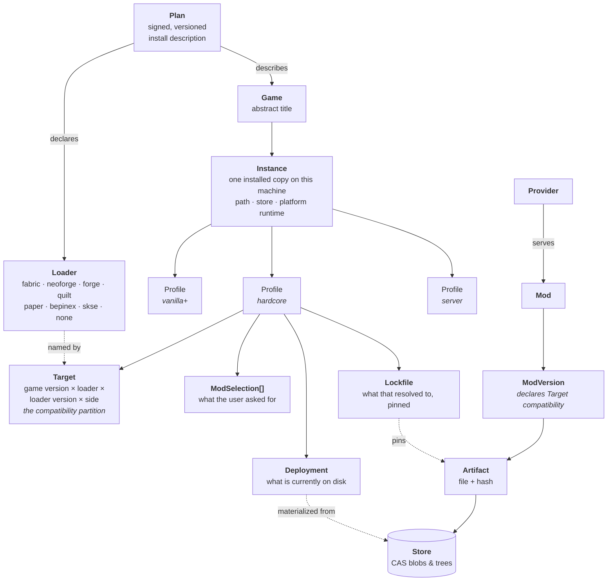

# 01 — Domain Model

The vocabulary below is normative. These names appear in the Rust types, the RPC
schema, the CLI nouns and the UI. Divergence between layers is a bug.

## Entities

**Plan** — a versioned, signed document describing how one game installs mods.
Identified by a reverse-DNS-ish id (`nomanssky`, `minecraft`, `bethesda.skyrimse`).
Plans may `extend` another plan, which is how the Bethesda family shares 90% of its
behaviour. A plan **declares the loaders its game supports** (below). See [02](02-plan-system.md).

**Game** — the abstract title. Carries the plan id, display metadata, and detection
rules. Not tied to a filesystem path.

**Instance** — *one concrete installation*. This is the unit users actually operate
on, and making it distinct from Game is what lets someone hold Skyrim-on-Steam and
Skyrim-on-GOG at once. Holds: root path, store (`steam`/`gog`/`epic`/`xbox`/`manual`),
**platform runtime** (native / Proton `<version>` / Wine prefix path), and a capability
probe result (which materialization backends this volume supports).

**Loader** — *the mod-loading regime.* First-class, because it is the single hardest
partition in modding and it is not expressible as a dependency:

| | |
|---|---|
| `id` | `fabric`, `neoforge`, `forge`, `quilt`, `paper`, `bepinex`, `melonloader`, `skse`, `none` |
| `provides` | virtual loader APIs it satisfies — **Quilt provides `fabric`** |
| `bootstrap` | the Component that installs it, and how its version is pinned |
| `mod_metadata` | where a mod declares its dependencies — `fabric.mod.json`, `neoforge.mods.toml`, `mcmod.info`, plugin.yml |
| `targets` | which directories its mods deploy into — `mods/`, `plugins/`, `BepInEx/plugins/` |
| `config_format` | TOML · JSON5 · `.cfg` · `.properties` · YAML |
| `sides` | client, server, or both |

A Fabric mod on NeoForge is not a conflict to be resolved — it is **not a candidate**.
Modelling the loader as a mere dependency would lose that distinction and let the solver
propose builds that cannot physically load.

> **Compatibility layers are mods, not loaders.** Sinytra Connector is a NeoForge *mod*
> that adds a Fabric-mod runtime on top of NeoForge. So `provides` is declared by
> **Loaders and by Mods alike**, and a selected mod can *widen* the Target's candidate
> set — which means the pre-filter is not purely static. MSBE handles this as an explicit
> opt-in rather than silently: enabling a compatibility layer is a visible choice on the
> Profile that re-runs the filter and re-solves, and the lockfile records that the
> expanded candidate set came from a mod. Pretending it is free would produce builds that
> resolve on paper and fail at launch when the layer is removed.

The same shape appears well outside Minecraft: BepInEx versus MelonLoader for Unity
titles, script-extender versus plain-plugin Bethesda mods, and Paper/Bukkit plugins
versus Forge mods — which are *different loaders for the same game*, with entirely
disjoint mod ecosystems.

**Target** — the compatibility tuple carried by a **Profile**:
`{ game_version, loader, loader_version, side }`. Every `ModVersion` declares which
Targets it supports, and the solver treats this as a hard filter applied *before*
version resolution ([05 §5.2](05-solver.md)). For games with a single fixed loading
regime, the Target is degenerate and invisible in the UI.

> **Why Target sits on the Profile, not the Instance.** Switching loader means
> switching the entire mod set — which is precisely what a Profile is for. One Minecraft
> directory can hold a Fabric profile, a NeoForge profile and a Paper server profile side
> by side. Where the *installation* fixes the game version (Skyrim, NMS), the Instance
> supplies it and the Profile's Target inherits; where the launcher manages versions
> per-profile (Minecraft), the Target owns it. Both cases use one field, and the plan
> says which way it flows.

**Profile** — a named, switchable mod set within an Instance, carrying one Target.
Cheap to create, cheap to switch (switching is a tree diff, not a reinstall). Holds
user intent, not results.

**ModSelection** — user intent: "I want `sodium`, any version compatible with this
Target", or "`sodium` pinned to `0.5.8`", plus flags (optional, disabled-but-kept).
Deliberately separate from the Lockfile so `msbe update` has something to re-solve *from*.

**Lockfile** — the solved, pinned result. Every entry names a provider, a mod id, an
exact version, artifact hashes, the plan version used, **the Target it was solved
against**, and the resolved install shape (e.g. which FOMOD options were chosen). This
is the shareable artifact and the reproducibility contract. Text, diffable, checked into
git by power users.

**Deployment** — the record of what is currently materialized into the Instance root:
every path MSBE created or overwrote, the backend used, and the backup reference for
anything it displaced. This is what makes `purge` exact.

**Provider** — a source of mods (Nexus, Modrinth, CurseForge, Thunderstore, GitHub
Releases, a CKAN repo, a local directory, a direct URL). Uniform interface, wildly
non-uniform policy — see [06](06-providers-and-policy.md).

**Mod / ModVersion / Artifact** — the usual three-level split. A `ModVersion` declares
its supported Targets and its dependencies; an `Artifact` is a single downloadable file
with a known size and hash. One ModVersion may have several (main file, optional patch,
a translation) — and on some providers, **a different artifact per loader**.

**Component** — a non-mod dependency a plan can require: a loader bootstrap (Fabric
installer, BepInEx, SKSE), a runtime patch, a script extender. Distinct from Loader:
the Loader is the *regime*, the Component is the *installable that establishes it*.
Components usually install into the game directory proper rather than being
profile-scoped, and come from the upstream author rather than a mod host.

**Store (CAS)** — the content-addressed store. Blobs by hash, plus "unpacked trees" (an
archive extracted once and reused by every profile that references it).

## Three things worth noticing in this model

**Intent and result are separate objects.** `ModSelection` → solver → `Lockfile` →
resolver → `OperationSet` → applier → `Deployment`. Each arrow is a pure function of its
input plus the plan. This is what makes dry-run trustworthy and `bisect` cheap.

**Target is a filter, not a constraint.** Loader incompatibility is resolved by
exclusion from the candidate set, before the solver runs. This keeps the solver's search
space small on 250-mod packs and makes its failure messages far more useful — "no
version of this mod supports NeoForge 1.21" instead of an opaque derivation chain.

**Nothing here is game-specific.** "Load order" is not a field — it is a plan-declared
ordering strategy, and games without ordering simply don't declare one. Likewise a game
with one loading regime declares one Loader and its users never see the concept.
