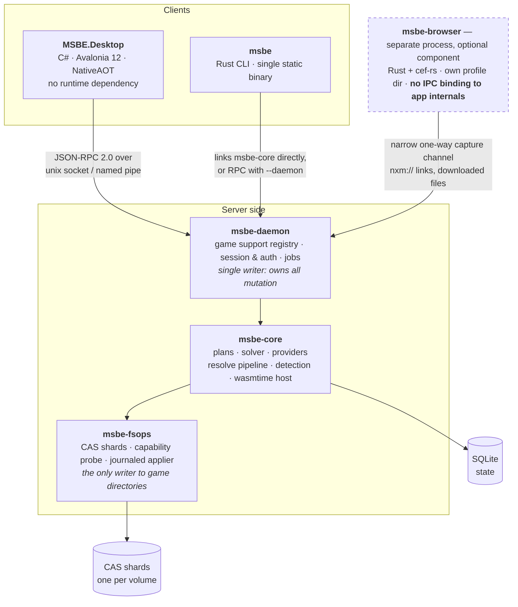

# 03 — Architecture

## 3.1 Process model



Why a daemon rather than FFI from C# into a Rust `cdylib`:

- **Headless/server mode falls out for free** — a Minecraft server admin runs
  `msbe-daemon` on a box with no display and drives it from the CLI or remotely.
- **Crash isolation.** A panic in archive parsing does not take the UI with it.
- **One writer.** All mutation funnels through a single process holding an
  instance-scoped lock, which is how we avoid two clients half-deploying a profile.
- **NativeAOT stays easy.** No P/Invoke marshalling layer to keep trim-safe, no
  native lib to ship per-RID alongside the AOT binary.

Cost: a serialization boundary, and progress/streaming has to be designed rather than
being a callback. Accepted — see 3.4.

### Runtime game support

Plans are a developer and registry concern. Player-facing clients deal in supported
games: the daemon validates every `plans/<game-id>/plan.toml` beneath its run directory
at startup and exposes their game names and ecosystems through `game.list`. The Desktop
registers an instance with a game ID; the daemon resolves that ID to the currently loaded
manifest and core pins a copy into the instance for reproducibility.

The developer RPC methods `plan.load` and `plan.unload` reload or remove one game ID at
runtime. Loading is restricted to the daemon's configured plans directory and validates
the manifest before replacing an existing entry. Unloading prevents new instances from
using that game; existing instances keep their pinned copy and continue to work. Pass
`--plans DIR` to the daemon to override the default `<run-directory>/plans` directory.

## 3.2 Repository layout

```
crates/
  msbe-core/          plans, solver, providers, resolve pipeline, detection
  msbe-plan-schema/   manifest types + validation (shared with registry CI)
  msbe-plan-host/     sandboxed wasmtime host for run-extension steps: grants, limits, operation checks
  msbe-step-guest/    guest SDK for step extensions (wasm32-unknown-unknown)
  msbe-wasm-codec/    sandboxed wasmtime host for pack codecs
  msbe-codec-guest/   guest SDK for pack codecs
  msbe-archive/       hardened extraction (zip/7z/rar/tar), path safety
  msbe-fsops/         CAS shards, capability probe, journaled applier (the only writer)
  msbe-provider-api/  neutral adapter and pack-codec contracts; HttpClient, acquisition, resolution; no TLS
  msbe-provider-*/    one crate per provider/format extension (modrinth, direct, local); no TLS
  msbe-providers/     reviewed adapter and codec registrations, behind the policy gate
  msbe-pack/          provider-neutral pack orchestration: options, blob policy, previews, snapshots
  msbe-http/          the one crate that links TLS: ureq + rustls/ring, OS trust store
  msbe-daemon/        JSON-RPC server, job queue, session auth
  msbe-cli/           clap; --format json; stable exit codes
  msbe-rpc-schema/    the RPC contract; generates C# client + TS types + JSON Schema
  msbe-browser/       CEF host process via cef-rs, nxm:// capture, assisted queue

dotnet/
  Directory.Build.props    every setting, so .csproj files stay near-empty
  Directory.Build.targets  MSBE0001-0005: posture assertions a .csproj cannot opt out of
  Directory.Packages.props central package management
  BannedSymbols.txt        the C# counterpart to clippy.toml's disallowed-methods
  stylecop.json  global.json  NuGet.Config  MSBE.slnx
  src/MSBE.Client/    generated RPC client (source-generated JSON, no reflection)
  src/MSBE.Desktop/   Avalonia 12 app, PublishAot
    ViewModels/         MainViewModel.<Feature>.cs feature partials
    Views/{Shell,Pages,Components}/   paired .axaml + .axaml.cs
    Styles/AppStyles.axaml
  tests/MSBE.Desktop.Tests/

plans/                first-party plans (mirrored into the registry)
fixtures/             synthetic game dirs + mod archives for tests
scripts/development/  check.sh, check-xaml.sh, format.sh, install-git-hooks.sh
docs/
```

### Provider and pack extension boundary

Provider registrations expose acquisition adapters and optional pack codecs. A codec owns an
external format's detection, wire records, game/loader identity mapping and import/export rules;
`msbe-pack` owns only generic codec selection, option validation and blob planning. Consequently
the CLI, daemon, Desktop and core never branch on provider, game, loader or external format IDs.

The native `.msbepack` codec uses the same registration and planning path. It packages the
canonical lockfile plus selected content-addressed blobs; it is not a special CLI code path. See
[17](17-pack-formats-and-native-bundles.md) for the complete contract, deterministic archive
layout, redistribution policy and migration from the current format-specific implementation.

## 3.3 NativeAOT constraints — non-negotiable from commit #1

Avalonia 12 supports NativeAOT, but only for trim-safe code. These are enforced by
analyzers and CI from the start, because retrofitting them is far more expensive than
following them:

```xml
<PublishAot>true</PublishAot>
<InvariantGlobalization>false</InvariantGlobalization>
<TrimMode>full</TrimMode>
<AvaloniaUseCompiledBindingsByDefault>true</AvaloniaUseCompiledBindingsByDefault>
<IsAotCompatible>true</IsAotCompatible>
```

- **Compiled bindings only.** `x:DataType` on every view; `ReflectionBinding` banned
  by analyzer rule. This also catches binding typos at build time, which is a win.
- **Source-generated JSON.** Every RPC DTO lives under a `JsonSerializerContext`.
  `msbe-rpc-schema` generates these DTOs, so they are correct by construction.
- **No reflection-based DI.** Hand-wired composition root or a source-generated
  container. No `Autofac`/`Splat`-style runtime scanning.
- **No `dynamic`, no `Activator.CreateInstance`, no runtime-emitted proxies.** That
  rules out most classic MVVM frameworks' magic; use `CommunityToolkit.Mvvm`, which
  is source-generator based and AOT-clean.
- **No cross-compilation.** NativeAOT must build on the target OS/arch. The CI matrix
  is therefore six real runners (see [12](12-testing-and-release.md)), not one.
- **Every third-party control is an AOT liability.** Each one needs an explicit
  smoke test in the AOT-published build, not just in `dotnet run`.

These are enforced rather than documented. `Directory.Build.targets` fails the build
(`MSBE0001`-`MSBE0005`) if a project disables nullable, warnings-as-errors, the trim or
AOT analyzers, compiled bindings, or lock files; `BannedSymbols.txt` rejects
`System.Reflection.Emit`, `Activator.CreateInstance`, reflection-based `JsonSerializer`,
`ReflectionBindingExtension`, `Task.Result`/`.Wait()` and `DateTime.Now`; and
`scripts/development/check-xaml.sh` fails a `{Binding}` in any view without `x:DataType`.
CI publishes all six RIDs on every PR, because an AOT failure is invisible to
`dotnet build`. See `CONTRIBUTING.md`.

## 3.4 RPC contract

JSON-RPC 2.0 over a Unix domain socket (`$XDG_RUNTIME_DIR/msbe.sock`, mode 0600) or a
Windows named pipe with a per-user DACL. Optional TCP for headless-server mode, off by
default, bearer-token authenticated, loopback-bound unless explicitly opened.

`msbe-rpc-schema` is the single source of truth and generates:

- Rust server traits,
- C# DTOs + client with `JsonSerializerContext`,
- a JSON Schema for third-party clients and for contract tests.

Long operations are **jobs**, not blocking calls:

```
job.start   { method, params }          -> { job_id }
job.events  { job_id, after }           -> { state, events after `after`, next }
job.cancel  { job_id }                  -> { cancelled }
job.answer  { job_id, question_id, .. } -> ack        # reserved: FOMOD wizards, conflict prompts
```

Contract 4 implements `job.start`, `job.events` and `job.cancel`. The daemon runs jobs one at a
time on a worker thread that holds the instance-state lock, so the listener keeps answering
progress and cancellation while requests that read or write instance state answer busy
(`-32020`). `job.events` is a cursor poll: a client passes the last sequence it saw and receives the
newer `progress`, `done`, `failed` or `cancelled` events, with consecutive progress coalesced into
the latest. Cancellation is cooperative: operations check it between steps and before they commit,
so a cancelled job leaves no partial profile or output. Pack execute methods and snapshots run only
as jobs ([17](17-pack-formats-and-native-bundles.md) §17.13).

The `Question` event and `job.answer` arrive with the first installer-question producer. The
`Question` event is how an interactive install wizard works identically in the GUI
(a dialog), the CLI (a prompt), and CI (`--non-interactive` → fail with the unanswered
question, or `--answers answers.toml` to pre-supply them). One mechanism, three faces.

## 3.5 State storage

- `$XDG_CONFIG_HOME/msbe/` — config, `%APPDATA%`/`~/Library/Application Support` equivalents.
- **Store shards, one per volume.** CAS blobs and trees live on the same volume as the
  instances they serve, inside the managed library (for example
  `<SteamLibrary>/.msbe/store/`), because hardlinks and reflinks cannot cross volumes.
  See [04 §4.1](04-deployment-engine.md).
- `$XDG_STATE_HOME/msbe/state.db` — SQLite (WAL): instances, profiles, selections,
  deployments, journal index, and the location of every store shard. Schema migrations versioned and tested both ways.
- Lockfiles live **inside the profile directory** and are meant to be copied, mailed,
  and committed to git.
