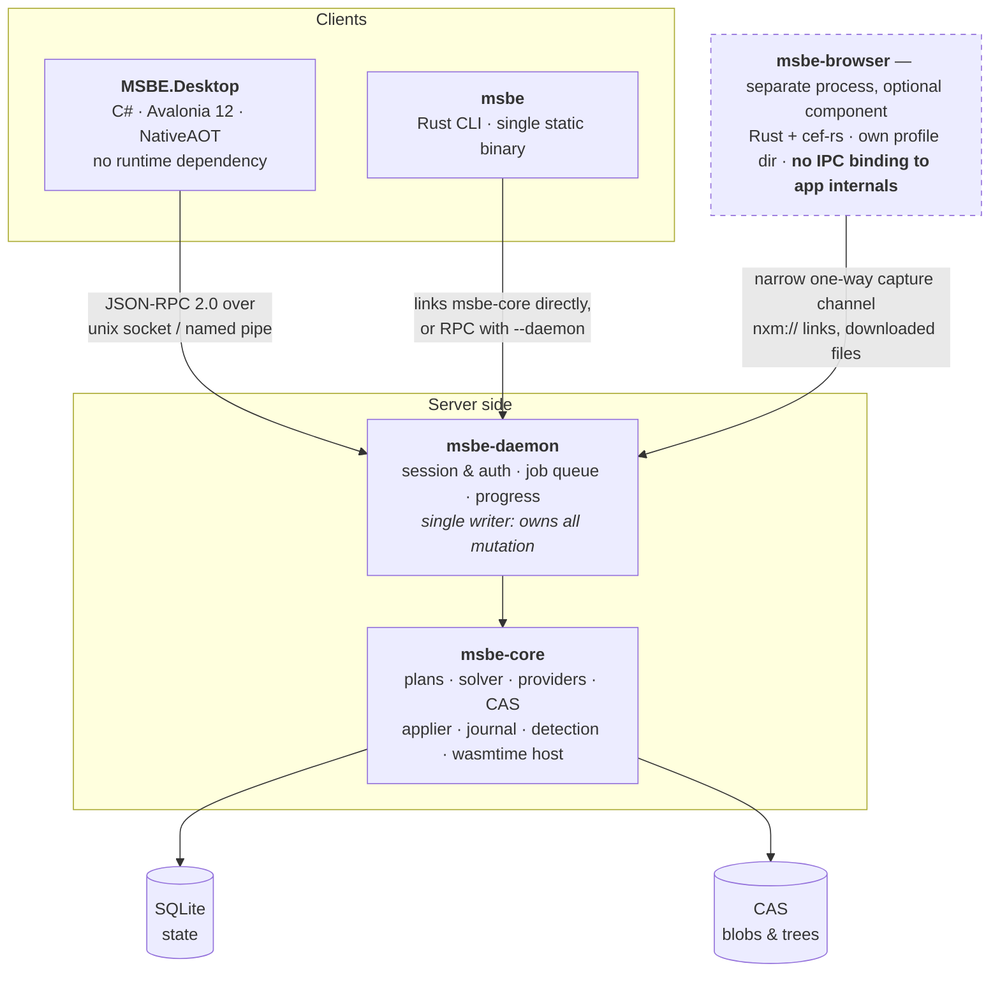

# 03 — Architecture

## 3.1 Process model



Why a daemon rather than FFI from C# into a Rust `cdylib`:

- **Headless/server mode falls out for free** — a Minecraft server admin runs
  `msbe-daemon` on a box with no display and drives it from the CLI or remotely.
- **Crash isolation.** A panic in archive parsing does not take the UI with it.
- **One writer.** All mutation funnels through a single process holding an
  instance-scoped lock, which is how we avoid two clients half-deploying a profile.
- **NativeAOT stays easy.** No P/Invoke marshalling layer to keep trim-safe, no
  native lib to ship per-RID alongside the AOT binary.

Cost: a serialization boundary, and progress/streaming has to be designed rather than
being a callback. Accepted — see 3.4.

## 3.2 Repository layout

```
crates/
  msbe-core/          plans, solver, providers, CAS, applier, journal, detection
  msbe-plan-schema/   manifest types + validation (shared with registry CI)
  msbe-plan-host/     wasmtime host, capability enforcement, WIT bindings
  msbe-archive/       hardened extraction (zip/7z/rar/tar), path safety
  msbe-fsops/         materialization backends, reflink/hardlink probes, journal
  msbe-providers/     nexus, modrinth, curseforge, thunderstore, github, ckan, local
  msbe-daemon/        JSON-RPC server, job queue, session auth
  msbe-cli/           clap; --format json; stable exit codes
  msbe-rpc-schema/    the RPC contract; generates C# client + TS types + JSON Schema
  msbe-browser/       CEF host process via cef-rs, nxm:// capture, assisted queue

dotnet/
  Directory.Build.props    every setting, so .csproj files stay near-empty
  Directory.Build.targets  MSBE0001-0005: posture assertions a .csproj cannot opt out of
  Directory.Packages.props central package management
  BannedSymbols.txt        the C# counterpart to clippy.toml's disallowed-methods
  stylecop.json  global.json  NuGet.Config  MSBE.slnx
  src/MSBE.Client/    generated RPC client (source-generated JSON, no reflection)
  src/MSBE.Desktop/   Avalonia 12 app, PublishAot
    ViewModels/         MainViewModel.<Feature>.cs feature partials
    Views/{Shell,Pages,Components}/   paired .axaml + .axaml.cs
    Styles/AppStyles.axaml
  tests/MSBE.Desktop.Tests/

plans/                first-party plans (mirrored into the registry)
fixtures/             synthetic game dirs + mod archives for tests
scripts/development/  check.sh, check-xaml.sh, format.sh, install-git-hooks.sh
docs/
```

## 3.3 NativeAOT constraints — non-negotiable from commit #1

Avalonia 12 supports NativeAOT, but only for trim-safe code. These are enforced by
analyzers and CI from the start, because retrofitting them is far more expensive than
following them:

```xml
<PublishAot>true</PublishAot>
<InvariantGlobalization>false</InvariantGlobalization>
<TrimMode>full</TrimMode>
<AvaloniaUseCompiledBindingsByDefault>true</AvaloniaUseCompiledBindingsByDefault>
<IsAotCompatible>true</IsAotCompatible>
```

- **Compiled bindings only.** `x:DataType` on every view; `ReflectionBinding` banned
  by analyzer rule. This also catches binding typos at build time, which is a win.
- **Source-generated JSON.** Every RPC DTO lives under a `JsonSerializerContext`.
  `msbe-rpc-schema` generates these DTOs, so they are correct by construction.
- **No reflection-based DI.** Hand-wired composition root or a source-generated
  container. No `Autofac`/`Splat`-style runtime scanning.
- **No `dynamic`, no `Activator.CreateInstance`, no runtime-emitted proxies.** That
  rules out most classic MVVM frameworks' magic; use `CommunityToolkit.Mvvm`, which
  is source-generator based and AOT-clean.
- **No cross-compilation.** NativeAOT must build on the target OS/arch. The CI matrix
  is therefore six real runners (see [12](12-testing-and-release.md)), not one.
- **Every third-party control is an AOT liability.** Each one needs an explicit
  smoke test in the AOT-published build, not just in `dotnet run`.

These are enforced rather than documented. `Directory.Build.targets` fails the build
(`MSBE0001`-`MSBE0005`) if a project disables nullable, warnings-as-errors, the trim or
AOT analyzers, compiled bindings, or lock files; `BannedSymbols.txt` rejects
`System.Reflection.Emit`, `Activator.CreateInstance`, reflection-based `JsonSerializer`,
`ReflectionBindingExtension`, `Task.Result`/`.Wait()` and `DateTime.Now`; and
`scripts/development/check-xaml.sh` fails a `{Binding}` in any view without `x:DataType`.
CI publishes all six RIDs on every PR, because an AOT failure is invisible to
`dotnet build`. See `CONTRIBUTING.md`.

## 3.4 RPC contract

JSON-RPC 2.0 over a Unix domain socket (`$XDG_RUNTIME_DIR/msbe.sock`, mode 0600) or a
Windows named pipe with a per-user DACL. Optional TCP for headless-server mode, off by
default, bearer-token authenticated, loopback-bound unless explicitly opened.

`msbe-rpc-schema` is the single source of truth and generates:
- Rust server traits,
- C# DTOs + client with `JsonSerializerContext`,
- a JSON Schema for third-party clients and for contract tests.

Long operations are **jobs**, not blocking calls:

```
job.start   { method, params }          -> { job_id }
job.events  { job_id }                  -> stream of Progress | Log | Question | Done
job.answer  { job_id, question_id, .. } -> ack        # FOMOD wizards, conflict prompts
job.cancel  { job_id }
```

The `Question` event is how an interactive install wizard works identically in the GUI
(a dialog), the CLI (a prompt), and CI (`--non-interactive` → fail with the unanswered
question, or `--answers answers.toml` to pre-supply them). One mechanism, three faces.

## 3.5 State storage

- `$XDG_CONFIG_HOME/msbe/` — config, `%APPDATA%`/`~/Library/Application Support` equivalents.
- **Store shards, one per volume.** CAS blobs and trees live on the same volume as the
  instances they serve, inside the managed library (for example
  `<SteamLibrary>/.msbe/store/`), because hardlinks and reflinks cannot cross volumes.
  See [04 §4.1](04-deployment-engine.md).
- `$XDG_STATE_HOME/msbe/state.db` — SQLite (WAL): instances, profiles, selections,
  deployments, journal index, and the location of every store shard. Schema migrations versioned and tested both ways.
- Lockfiles live **inside the profile directory** and are meant to be copied, mailed,
  and committed to git.
