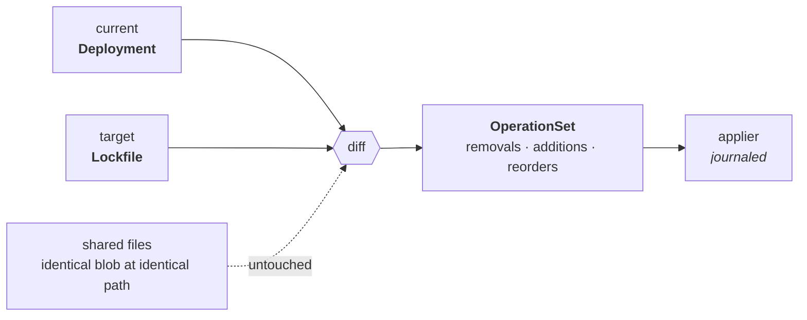
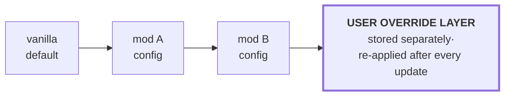

# 04 — Deployment Engine

The part that, if it has bugs, deletes somebody's 400-hour save directory. It gets the
most tests and the most paranoia.

## 4.1 Content-addressed store

```
store/
  blobs/sha256/ab/cdef0123…            every downloaded artifact, every extracted file
  trees/<tree-hash>/                   an extracted archive: paths → blob refs
  backups/sha256/…                     displaced original files (vanilla protection)
  tmp/                                 staging; same volume, atomic rename into place
```

Download → verify → blob. Extract once → tree (each entry hardlinked from its blob).
Every profile that uses the same mod version shares the same bytes. Ten profiles with
a 300-mod pack cost one copy of the pack plus a few hundred KB of manifests.

GC is refcount-based over lockfiles + deployments + backups, with a grace period and
`msbe store gc --dry-run` showing exactly what would go.

## 4.2 Materialization backends

| Backend | Windows | macOS | Linux | Notes |
|---|---|---|---|---|
| **reflink** (CoW) | ReFS only | APFS ✓ | btrfs, XFS ✓ | Best: cheap *and* isolated. Game can rewrite the file without corrupting the store. |
| **hardlink** | NTFS ✓ | ✓ | ✓ | Same volume only. **Danger:** a game or tool that writes in place mutates the store copy. Store blobs are mode 0444 and verified on use. |
| **copy** | ✓ | ✓ | ✓ | Always works. Costs disk. The universal fallback. |
| **symlink** | needs Developer Mode or admin | ✓ | ✓ | Many games and most anticheat break on it. Opt-in only. |
| **junction** | ✓ | – | – | Directory granularity only; useful for whole-folder mods. |
| **VFS overlay** | USVFS | ✗ none viable | fuse-overlayfs / bindfs | Purest (game dir never touched) but the least portable and the hardest to debug. |

**Default is the chain `reflink → hardlink → copy`**, probed per volume at instance
setup and cached. VFS is an advanced opt-in on Windows and Linux and is explicitly
**not offered on macOS** — promising it there and failing is worse than not offering it.

The probe is a real probe: MSBE creates a temp file in the store and attempts an
actual `FICLONE` / `clonefile` / `CreateHardLink` against the game directory, because
filesystem type is not a reliable proxy (bind mounts, network shares, Flatpak
sandboxes and case-insensitive volumes all lie).

## 4.3 Vanilla protection

Before an Instance is first modified, MSBE records a **baseline**: the hash of every
file matched by the plan's `protect` globs, plus every file it is about to touch.
Anything displaced is copied into `backups/` first.

`msbe purge` restores the baseline exactly and then verifies it. If a file MSBE did
not deploy has appeared inside a managed directory, purge reports it and leaves it
alone rather than guessing — silent deletion of a user's manual edit is unacceptable.

## 4.4 Transactional journal

Append-only, fsync'd before each operation:

```json
{ "seq": 412, "txn": "0f3a…", "op": "Materialize",
  "path": "GAMEDATA/MODS/BetterPlanets.pak",
  "backend": "reflink", "blob": "sha256:9c1f…",
  "prev": { "Backup": "sha256:44ab…" } }
```

- **Crash mid-deploy** → on next start the daemon sees an open `txn` and offers
  *resume* or *roll back*, both driven entirely from the journal.
- **Rollback** = replay backwards, restoring `prev` for each op.
- **`msbe verify`** = walk the deployment manifest, re-hash, report drift (a game
  updater overwrote a modded file; an antivirus quarantined a DLL).

Ordering rule: writes go to `tmp/` on the same volume, then `rename(2)` into place.
No partially-written file is ever visible at a real path.

## 4.5 Profile switching

Switching is a **tree diff**, not an uninstall + reinstall:



Shared files (identical blob at identical path) are untouched. Switching between two
250-mod Minecraft profiles that share 240 mods costs ~10 link operations. This is what
makes `msbe bisect` (see [09](09-interfaces.md)) practical rather than theoretical.

## 4.6 Conflict handling

Two layers, because they are genuinely different problems:

**File-level** — two mods provide the same path. Detected at resolve time, before
anything is written. Resolution per the plan's `[conflicts].policy`:
`priority-overwrite` (explicit user priority), `lexical`, `fail` (refuse and ask), or
`merge` (only for types with a registered structured merger). The UI shows a conflict
tree; the CLI prints it and, in `--non-interactive`, exits non-zero.

**Semantic** — two mods both patch the same config key, edit the same game record, or
declare mutual incompatibility. Detected by the plan (via `detect` predicates or an
extension) and by overlay metadata from the registry. This is where the curated
knowledge in [10](10-registry.md) earns its keep: upstreams almost never publish
"these two mods conflict," but communities know it.

**Structured config merge** gets its own layered model:



The user layer is stored separately and re-applied after every mod update, so
customising a config does not get silently reverted on the next `msbe update`. This
single behaviour is one of the most common complaints about existing Minecraft
managers and is cheap to get right if designed in from the start.
