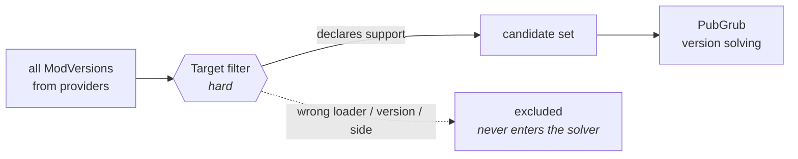
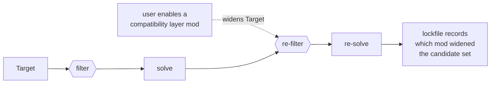

# 05 — Dependency Solver

## 5.1 Choice: PubGrub

Use the `pubgrub` crate. Rationale over a generic SAT/CDCL solver: PubGrub's defining
feature is **explainable failure**. When a 300-mod pack won't resolve, "no solution"
is useless; PubGrub produces a derivation tree that renders as:

```
Because sodium >=0.5 requires fabric-api >=0.92 and no version of fabric-api
matching >=0.92 is compatible with minecraft 1.20.1, sodium >=0.5 is forbidden.
And because iris 1.7 depends on sodium >=0.5, iris 1.7 is forbidden.
So, because you require iris 1.7, version solving failed.
```

That output is the difference between a tool people trust and a tool people fight.

## 5.2 Target is a pre-filter, not a constraint

Before any version solving happens, the candidate set is filtered by the profile's
**Target** — `{ game_version, loader, loader_version, side }` ([01](01-domain-model.md)).



This is deliberately *not* modelled as a dependency, for three reasons:

1. **It is not negotiable.** A Fabric mod on NeoForge cannot load. There is no version of
   it that would satisfy the constraint, so it should never be a candidate.
2. **Search space.** On a 250-mod pack, filtering first cuts the candidate set by an
   order of magnitude before PubGrub starts.
3. **Error quality.** "No version of `create` supports NeoForge 1.21.1" is actionable.
   The same fact expressed as a failed dependency produces a derivation chain that buries
   it.

**Loader `provides` makes forks work.** Quilt declares `provides = ["fabric"]`, so a mod
requiring the Fabric loader is a candidate on a Quilt target. Without loader-level
`provides`, every fork would need every mod to re-declare support — exactly the
fragmentation the model exists to absorb.

**Mods can provide loader capabilities too, and that is the awkward case.** Sinytra
Connector is a NeoForge *mod* that adds a Fabric-mod runtime on top of NeoForge. A
selected mod therefore *widens* the candidate set, which breaks the clean
filter-then-solve ordering above. Rather than fold it into the solver — where it would
create a circular dependency between candidacy and selection — MSBE treats it as an
explicit, visible opt-in:



The lockfile records the provenance, so removing the layer invalidates exactly the mods
that depended on it instead of producing a build that resolves on paper and fails at
launch.

**Side matters as much as loader.** A `side = "server"` target simply cannot select a
client-only mod — the filter removes it rather than the user discovering it at launch.

## 5.3 Version semantics are per-ecosystem

The solver is generic over a `VersionSet` trait; each ecosystem supplies an impl:

| Ecosystem | Semantics |
|---|---|
| Modrinth / Fabric / NeoForge | SemVer, with Fabric's range syntax |
| CurseForge | no real versioning — file ids ordered by release date, plus declared game-version tags |
| Thunderstore | SemVer, strictly enforced |
| CKAN | its own `epoch:version` ordering rules |
| Nexus / Bethesda | **opaque strings.** Ordered only by upload date; ranges are meaningless |
| GitHub Releases | tag-derived, best-effort SemVer with a fallback to date order |

For opaque-version ecosystems the "solver" degrades honestly to dependency *presence*
checking plus registry-supplied incompatibility rules. Pretending Skyrim mods have
resolvable version ranges would be fiction; the plan says which mode it is in.

## 5.4 Constraint sources

1. **Provider-declared deps** — Modrinth and Thunderstore publish real dependency
   graphs. CurseForge publishes weaker ones. Nexus publishes essentially none.
2. **Registry overlay** — curated `depends` / `conflicts` / `provides` / `replaces` /
   `known-bad` entries. This is where community knowledge that upstream doesn't
   model gets encoded, and it is MSBE's main advantage over per-site tooling.
3. **Plan-derived** — a plan can compute constraints (e.g. a Bethesda extension
   reading ESM masters out of a plugin header to derive a hard dependency).
4. **Target & instance facts** — the Target tuple (applied as the pre-filter above), plus platform runtime, so a Proton-incompatible mod can be flagged.

## 5.5 Virtual packages

`provides` handles the cases that otherwise break everything:

- **Loader-level** — Quilt provides `fabric`. Handled in the Target pre-filter (§5.2).
- **Compatibility-layer mods** — Sinytra Connector, a NeoForge mod providing a Fabric
  runtime. Declared like any mod, but widens the Target; handled as the explicit opt-in
  described in §5.2.
- **API-level** — "any BepInEx 5.x"; Fabric API forks and reimplementations.
- **Mod-level** — a patch mod that `replaces` an abandoned original.

These are one mechanism at four altitudes, which is why all four are worth having:
without loader-level, a fork fragments the ecosystem; without mod-level, one abandoned
mod blocks everything downstream of it.

**API- and mod-level are implemented (M2).** A candidate release may `provides` or
`replaces` other packages, and `msbe_core::solver` applies four rules:

1. **A requirement without an exact release is met by the package or by anything that
   supplies it.** Sodium requiring Fabric API is satisfied by Quilted Fabric API already in
   the profile.
2. **At most one selected package supplies a package**, the package itself included. Two
   implementations of one API claim the same mod id, and Fabric and Quilt Loader refuse to
   start with both, so asking for both is an explained conflict rather than a broken launch.
3. **Preference, when nothing else decides:** a replacement over the abandoned original it
   replaces, and the original over a package that merely provides it. A fork is chosen when
   something asks for it by name, or when the original has no release for the Target.
4. **Exact releases and roots are never substituted.** A pin names one release, and a mod the
   user asked for by name is the mod they get.

Each supplied package becomes a PubGrub package of its own whose versions are its possible
suppliers, most preferred highest. Exclusivity and preference are therefore ordinary version
solving, and a conflict keeps its derivation explanation.

The facts come from the overlay ([10](10-registry.md)). MSBE ships entries for Quilted Fabric
API and Forgified Fabric API, each checked against the `provides` in its own mod metadata.
Mods already in a profile take part in resolution, pinned to their installed release, so
adding a mod to a profile that has a reimplementation does not install a second copy. Reading
`provides` straight from `fabric.mod.json` and `neoforge.mods.toml` waits on the artifact
metadata reader.

## 5.6 Optional & soft constraints

Three strengths, because modding needs all three:
- **hard** — must be satisfied or resolution fails;
- **recommended** — offered, defaulted on, one click to decline;
- **suggested** — surfaced in the UI, never auto-selected.

Plus **`known-bad`**: a specific version blocklisted with a reason and a link. Cheap
to add to the registry, and prevents a lot of "the pack broke overnight" reports.

## 5.7 Update strategies

- `msbe update` — re-solve from `ModSelection`, honour pins, minimal change.
- `msbe update --latest` — relax to newest compatible.
- `msbe update <mod>` — single-mod bump with its dependency closure.
- Always emits a **lockfile diff** for review before applying, and every update is a
  journaled transaction, so a bad update is one `msbe rollback` away.
