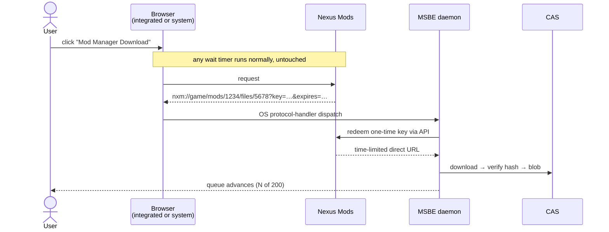

# 06 — Providers & Policy

Providers are technically uniform and legally *not*. The policy layer is a
first-class part of the design, not a README disclaimer — getting this wrong is the
most likely way this project dies, and it would die by C&D rather than by bug.

## 6.1 Uniform interface

```rust
trait Provider {
    fn search(&self, q: &Query)                 -> Result<Vec<Mod>>;
    fn versions(&self, id: &ModId)              -> Result<Vec<ModVersion>>;
    fn artifacts(&self, v: &ModVersionId)       -> Result<Vec<Artifact>>;
    fn acquire(&self, a: &ArtifactId)           -> Result<Acquisition>;
    fn policy(&self)                            -> &ProviderPolicy;
}

enum Acquisition {
    DirectUrl { url, headers, expires },
    BrowserAssisted { page_url, capture: CaptureSpec },   // user must act
    Unavailable { reason, user_action },                  // e.g. "download on site"
}
```

`Acquisition` is deliberately a three-way enum. "We cannot fetch this for you" is a
normal, well-typed outcome — not an error and not an invitation to work around it.

## 6.2 Policy matrix

| Provider | Auth | Programmatic download | Notable constraints |
|---|---|---|---|
| **Modrinth** | none for public; token for private | ✓ open API | **Implemented (M1).** Real dependency graph. Requires an identifying User-Agent; 300 requests a minute, surfaced as `RateLimited` with the reset time. Downloads are https-only and verified against the published size and SHA-512 before ingest. Updates are found with the bulk hash endpoints (`POST /version_files` and `/version_files/update`), at most four requests however many mods are installed. A mod stays on its release channel or moves to a more stable one, and never goes to an older version unless the installed one no longer supports the instance. |
| **Thunderstore** | none | ✓ | Clean SemVer, clean package format. |
| **CurseForge** | API key required | ✓ *conditionally* | **Must honour `allowModDistribution: false`.** When false, third-party download is forbidden — return `Unavailable` and send the user to the mod page. Non-negotiable; this flag is why several managers got access revoked. |
| **Nexus Mods** | personal API key / OAuth | premium: ✓ direct. free: ✗ | Free accounts have no programmatic file download. The *supported* path is the `nxm://` handler (see below). Rate limits published per-key; honour them and the `X-RL-*` response headers. |
| **GitHub Releases** | optional token | ✓ | Watch unauthenticated rate limits. |
| **CKAN repos** | none | ✓ | Consume the existing index; do not fork it. |
| **Local / direct URL** | n/a | ✓ | Always available; the manual escape hatch. |

TLS for every provider goes through `msbe-http`, which trusts the operating system's
certificate store rather than a bundled list of roots. That respects system and corporate
certificate authorities, and keeps `webpki-roots` (CDLA-Permissive-2.0, which `deny.toml`
does not allow) out of the dependency graph.

Encoded as data in `ProviderPolicy`, not as scattered `if` statements:

```rust
struct ProviderPolicy {
    requires_auth: bool,
    rate_limit: RateLimit,            // token bucket, honours Retry-After / 429
    respects_distribution_flag: bool,
    user_agent: &'static str,         // honest: "MSBE/0.4 (+https://…)"
    tos_url: &'static str,
    ack_required: bool,               // user must acknowledge once, per provider
}
```

## 6.3 What we will not do

Stated here so it is never re-litigated in a PR:

- No captcha solving, no wait-timer skipping, no ad-gate bypass.
- No spoofing premium status, session tokens, or another client's User-Agent.
- No scraping around a published rate limit, and no distributing shared API keys.
- No mirroring or re-hosting mod binaries.
- No ignoring `allowModDistribution: false` or any equivalent opt-out.

MSBE identifies itself honestly in every request. If a provider asks us to change
something, we change it. The alternative is losing access for all users — which is
what has happened to every tool that treated these as obstacles.

## 6.4 The `nxm://` path (why free Nexus users are fine)

Nexus provides "Mod Manager Download" buttons that emit `nxm://` links **for free
accounts too**. That is the sanctioned mechanism, and it is what MO2 and Vortex use.



MSBE registers the protocol handler on all three platforms and catches links from
**the integrated browser or the user's system browser alike** — a user who prefers
Firefox loses nothing.

## 6.5 Assisted download queue (the large-modpack case)

The honest version of "browser automation." For a 200-mod Nexus list on a free
account, MSBE:

1. resolves the list to concrete mod/file pages;
2. shows a queue with progress — *N of 200*;
3. navigates the integrated browser to the next page in the queue;
4. **waits for the user to click the download button**, and any wait timer runs
   normally, un-touched;
5. captures the resulting `nxm://` link, ingests the file, advances the queue.

The automation is *navigation and capture*, not *clicking through gates*. It removes
tab management and copy-pasting, which is the actual tedium, and it leaves every
access control exactly where the site put it. Rate-limited, resumable, and cancellable.

Optionally an "auto-advance" toggle moves to the next page after a successful capture.
There is no toggle that clicks the download button.

## 6.6 Operational asks

Tasks, not afterthoughts — start them early because approval takes weeks:

- Apply for an official **CurseForge API key** for a named application.
- Apply for a **Nexus Mods** application/API registration and open a channel with
  their team before launch, not after.
- Publish the User-Agent, contact address and a clear statement of what MSBE does and
  does not do, so providers can evaluate us without reverse-engineering traffic.
