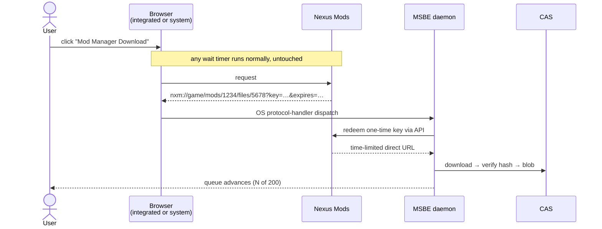

# 06 — Providers & Policy

Providers are technically uniform and legally _not_. The policy layer is a
first-class part of the design, not a README disclaimer — getting this wrong is the
most likely way this project dies, and it would die by C&D rather than by bug.

## 6.1 Uniform interface

```rust
trait Provider {
    fn search(&self, q: &Query)                 -> Result<Vec<Mod>>;
    fn versions(&self, id: &ModId)              -> Result<Vec<ModVersion>>;
    fn artifacts(&self, v: &ModVersionId)       -> Result<Vec<Artifact>>;
    fn acquire(&self, a: &ArtifactId)           -> Result<Acquisition>;
    fn policy(&self)                            -> &ProviderPolicy;
}

enum Acquisition {
    DirectUrl { url, headers, expires },
    BrowserAssisted { page_url, capture: CaptureSpec },   // user must act
    Unavailable { reason, user_action },                  // e.g. "download on site"
}
```

`Acquisition` is deliberately a three-way enum. "We cannot fetch this for you" is a
normal, well-typed outcome — not an error and not an invitation to work around it.

## 6.2 Policy matrix

| Provider               | Auth                               | Programmatic download      | Notable constraints                                                                                                                                                                                                                                                                                                                                                                                                                                                                                                                                                          |
| ---------------------- | ---------------------------------- | -------------------------- | ---------------------------------------------------------------------------------------------------------------------------------------------------------------------------------------------------------------------------------------------------------------------------------------------------------------------------------------------------------------------------------------------------------------------------------------------------------------------------------------------------------------------------------------------------------------------------- |
| **Modrinth**           | none for public; token for private | ✓ open API                 | **Implemented (M1).** Real dependency graph. Requires an identifying User-Agent; 300 requests a minute, surfaced as `RateLimited` with the reset time. Downloads are https-only and verified against the published size and SHA-512 before ingest. Updates are found with the bulk hash endpoints (`POST /version_files` and `/version_files/update`), at most four requests however many mods are installed. A mod stays on its release channel or moves to a more stable one, and never goes to an older version unless the installed one no longer supports the instance. |
| **Thunderstore**       | none                               | ✓                          | **Implemented as a program.** Packages are `Namespace-Name`, listed per community; `[games]` maps plan ids to communities, and a package not listed for the instance's game is refused. The package API carries only the latest version with its dependencies, so that is the release offered, and `releases-v1` updates to it by SemVer. No digests are published: downloads are checked for HTTPS and a safe name only.                                                                                                                                                                                                                                                                                                                                                                                                                                                                                                                                          |
| **CurseForge**         | API key required                   | ✓ _conditionally_          | **Must honour `allowModDistribution: false`.** When false, third-party download is forbidden — return `Unavailable` and send the user to the mod page. Non-negotiable; this flag is why several managers got access revoked. A program maps the flag with `mappings.release.file.distributable`; a file flagged off, or published with no download URL, is typed as a user download at its `[pages]` page and never transferred. Its SHA-1 and MD5 digests (`hashes[].algo` 1 and 2) are verified.                                                                                                                                                                                                                                                                                                                                                 |
| **Nexus Mods**         | personal API key / OAuth           | premium: ✓ direct. free: ✗ | Free accounts have no programmatic file download. The _supported_ path is the `nxm://` handler (see below). Rate limits published per-key; honour them and the `X-RL-*` response headers. A program selects `browser_assisted` acquisition with `scheme = "nxm"`, and names each game's domain in `[games]`, per edition where Nexus lists editions as separate games.                                                                                                                                                                                                                                                                                                                                                                                    |
| **GitHub Releases**    | optional token                     | ✓                          | Watch unauthenticated rate limits.                                                                                                                                                                                                                                                                                                                                                                                                                                                                                                                                           |
| **CKAN repos**         | none                               | ✓                          | Consume the existing index; do not fork it.                                                                                                                                                                                                                                                                                                                                                                                                                                                                                                                                  |
| **Steam Workshop**     | Steam account                      | SteamCMD or import         | **Planned.** MSBE may invoke a user-installed SteamCMD to acquire content the user's account is entitled to receive, or ingest a local file, archive, or directory obtained elsewhere. It will not implement Steam-client, depot, manifest, or authentication protocols itself.                                                                                                                                                                                                                                                                                              |
| **Local / direct URL** | n/a                                | ✓                          | Always available; the manual escape hatch. **Implemented (M1).** URLs must be https, redirects included. A `#sha256=` or `#sha512=` fragment pins a checksum that is verified before ingest, and every download's SHA-512 is recorded as provenance.                                                                                                                                                                                                                                                                                                                         |

TLS for every provider goes through `msbe-http`, which trusts the operating system's
certificate store rather than a bundled list of roots. That respects system and corporate
certificate authorities, and keeps `webpki-roots` (CDLA-Permissive-2.0, which `deny.toml`
does not allow) out of the dependency graph.

Adapters reach the network only through `HttpClient`. A request is an `HttpRequest`: its method
and JSON body, URL, query, headers, response size limit, and the response headers that report
remaining quota. `send` answers with an `HttpResponse`, the body and that quota; `download`
streams the body instead. The registry hands each adapter a client scoped to its provider. The
credential header the adapter names (`Adapter::api_headers`), and the quota headers, go only to
the origin of the provider's `api_base`; downloads carry neither, and the quota last reported is
`Providers::rate` ([07 §7.5](07-browser-and-secrets.md)).

Encoded as data in `ProviderPolicy`, not as scattered `if` statements:

```rust
struct ProviderPolicy {
    requires_auth: bool,
    rate_limit: RateLimit,            // token bucket, honours Retry-After / 429
    respects_distribution_flag: bool,
    user_agent: &'static str,         // honest: "MSBE/0.4 (+https://…)"
    tos_url: &'static str,
    ack_required: bool,               // user must acknowledge once, per provider
}
```

## 6.3 Provider manifests

Provider definitions are versioned TOML documents. MSBE ships the direct URL, Modrinth and
Thunderstore providers as provider programs (§6.4), whose manifests pass through the same validated catalog
that will consume signed registry definitions. A manifest declares identity, source recognition, metadata origin,
policy, and an acquisition primitive; it cannot execute code, alter HTTP transport rules, or
weaken policy enforcement.

```toml
schema = 1
id = "modrinth"
name = "Modrinth"

[source]
type = "prefixed"
prefix = "modrinth:"

[metadata]
api_base = "https://api.modrinth.com/v2"

[acquisition]
type = "direct_https"

[policy]
requires_auth = false
respects_distribution_flag = true
tos_url = "https://modrinth.com/legal/terms"
ack_required = false
```

The schema rejects unknown fields, duplicate provider ids, empty or non-ASCII source prefixes,
and metadata endpoints that are not HTTPS. The acquisition vocabulary is closed, and every
release file carries the `Download` it allows:

| `type`             | What MSBE does                                                                                                                                                                          |
| ------------------ | --------------------------------------------------------------------------------------------------------------------------------------------------------------------------------------- |
| `direct_https`     | downloads over HTTPS and verifies every published size and digest. A file its author flags as not distributable, or published with no download URL, is still a user download.            |
| `user_action`      | never downloads. Each file names the page to fetch it from; the user adds the saved file.                                                                                               |
| `browser_assisted` | as `user_action`, and names the URI `scheme` the page's mod-manager button hands over, such as `nxm`. Capturing and redeeming that link (§6.6) is not implemented yet.                  |
| `external_tool`    | runs the program the user registered for the provider, which fetches the item through its own flow; MSBE imports what it leaves. Only the `tool-v1` runtime serves it (§6.5).           |

`Adapter::acquire` refuses a file that is not a direct download with `AdapterError::ActionRequired`,
which names the page, before any transfer: the CLI exits with the policy code, and a pack import
reports `user_action_required`. A file a registered tool fetches is fetched only through the
download queue; the CLI's `add` and `update` and pack import refuse it with a message. `local_import`
remains a future primitive that requires a runtime implementation and policy review before a
manifest can select it.

The schema above is the M1 subset. The target model is a **provider program**: a versioned TOML
document interpreted by a reviewed, fail-closed runtime. The program is the default way to add a
provider. It declares only a composition of closed vocabulary items; it never supplies code,
scripts, regular expressions, arbitrary HTTP templates, or response transformations.

## 6.4 Provider programs

Provider programs have a strict envelope with a schema version, signer identity, and SHA-256
digest of their canonical payload. The registry accepts a program only when its signer is in the
configured trust allowlist and its digest is not revoked. Unknown fields, unsupported runtimes,
digest mismatches, untrusted signers, and revoked programs fail closed before an adapter exists.

The runtime vocabulary is closed. `direct-url-v1` parses HTTPS URLs and optional SHA-256/SHA-512
fragments; a pin is the user's guarantee about the bytes, so a weaker digest cannot pin a URL.
`catalog-v1` fills fixed slots with the games it serves, translations of target facts,
endpoint-relative routes and web pages, named request parameters, and bounded JSON pointers into
responses, and serves up to five capabilities:

| Capability        | What the runtime does                                                                                                                                   |
| ----------------- | ------------------------------------------------------------------------------------------------------------------------------------------------------- |
| `search`          | sends the words, a limit lowered to the catalog's `maximum`, and facet groups built from the target; drops hits whose side availability rules them out |
| `project`         | fetches a project by slug or ID, with its client and server availability                                                                                |
| `releases`        | sends target-derived query parameters, keeps releases for the game version, a target loader, the loader version, the edition and the storefront, and orders them newest first or by SemVer                 |
| `release-project` | finds the project a release belongs to, for a dependency that names only a release                                                                     |
| `updates`         | runs a reviewed update protocol: `hash-lookup-v1` looks installed files up by hash, `releases-v1` lists each installed project's releases; both keep a file on its release channel or a more stable one           |

A program cannot form arbitrary URLs, run scripts, or select a transport. Native registrations must
state a non-empty exception reason; they remain reserved for protocol semantics the reviewed
declarative vocabulary cannot represent. An excerpt of the Modrinth program
(`extensions/providers/modrinth/program.toml`):

```toml
runtime      = "catalog-v1"
capabilities = ["search", "project", "releases", "release-project", "updates"]

[routes]
search   = "/search"
project  = "/project/{reference}"
releases = "/project/{project}/version"
release  = "/version/{release}"

[search]
query   = "query"
maximum = 100
facets  = { parameter = "facets", groups = [["project_type:mod"], ["versions:{game_version}"], ["categories:{loader}"]] }

[releases]
order = "newest-first"
query = [
  { name = "loaders", target = "loaders" },
  { name = "game_versions", target = "game-version" },
  { name = "include_changelog", literal = "false" },
]

[updates]
type      = "hash-lookup-v1"
algorithm = "sha512"
listed    = "/version_files"
latest    = "/version_files/update"

[mappings.release]
id              = "/id"
project         = "/project_id"
published       = "/date_published"
loader_versions = "/loader_versions"
channel         = { pointer = "/version_type", release = "release", beta = "beta", alpha = "alpha" }
```

Validation refuses a program that declares a capability without the routes and mappings it needs,
a section without its capability, a route whose placeholders are not exactly the one it takes and
at most one `{game}`, an unknown facet placeholder, a parameter with no single value, a catalog
with no `[games]`, a game or translation that is not a safe identifier, a distribution flag its
policy does not respect, a file MSBE may not download with no page to send the user to, and
`releases-v1` over releases in the catalog's own order. It also refuses `[handoff]` without
`browser_assisted` acquisition or the reverse, a handoff path or redeem route without its
placeholders exactly once, `requires_auth` without `[auth]`, `[auth]` without
`[mappings.account]`, and a condition that is not exactly one of `equals` and `in`.

### Target facts and catalogs that serve many games

A program never sends or matches MSBE's spelling of a fact by accident; every fact passes through
it:

- **Games.** `[games]` maps each plan id the catalog serves to the catalog's identifier for it,
  optionally by edition (`game = { id = "2", editions = { original = "1" } }`). A target for any
  other game, or an edition with no identifier, is refused before a request is made. `{game}` may
  appear once in any route or page, `game` is a target fact for parameters and facets, and
  `mappings.project.games` refuses a project the catalog does not list for the target's game.
- **Target facts.** `game`, `game-version`, `loaders` (the loader and what it provides),
  `edition`, and `storefront`. A target without a fact sends nothing for it and accepts any release,
  so a game version is optional everywhere.
- **Translation.** `[translate]` gives the catalog's spelling of game versions, loaders, editions
  and storefronts. A fact with a table is known to the catalog only by the values it lists: another
  value is never sent and matches no release. A parameter's own `values` replace the table for that
  parameter, for catalogs whose requests and responses spell a value differently, such as a loader
  sent as `4` and listed as `Fabric`.
- **Encodings.** A parameter holds a `json-array` (the default), `comma`-separated values, one
  `repeated` pair per value, or a `single` value. A `single` parameter is left out, not truncated,
  when the target has several values, and the runtime filters the answer instead.
- **Mappings.** A selector is a pointer, or `{ each, value, when }` for a value inside each object of
  an array, such as the digest whose `algo` is `1`. Integers are read as their decimal text.
  `mappings.releases` and `files` accept `{ single = pointer }` for one object, such as a listing
  that is one package or a release that is its own file. `dependency.kinds` names the catalog's
  relationship kinds, `dependency.text` reads `Namespace-Name-1.0.0` strings, `routes.reference`
  splits a reference such as `Namespace-Name` into route segments, and `file.extension` names
  files a catalog serves without an extension.
- **Digests.** Files carry `md5`, `sha1`, `sha256` and `sha512` selectors, and every published
  digest is verified. SHA-1 and MD5 catch a corrupt or wrong file, not a deliberately colliding
  one; content identity stays SHA-256. A `hash-lookup-v1` program on a weak algorithm records that
  digest in provenance so installed files can be looked up again.
- **Updates.** `releases-v1` needs `[releases] order = "newest-first"` or `"semver"`. SemVer
  ignores a leading `v`, and releases whose number is not a version follow the rest by date. A
  catalog that no longer lists the installed release is compared by version number.

An excerpt of the Thunderstore program (`extensions/providers/thunderstore/program.toml`):

```toml
[games]
valheim = "valheim"

[routes]
reference = { separator = "-", segments = 2 }
project   = "/api/experimental/package/{reference}/"
releases  = "/api/experimental/package/{project}/"

[releases]
order = "semver"

[updates]
type = "releases-v1"

[mappings]
releases = { single = "/latest" }

[mappings.project]
games = { each = "/community_listings", value = "/community" }

[mappings.release.file]
url       = "/download_url"
name      = "/full_name"
extension = "zip"

[mappings.release.dependency]
text = { separator = "-" }
```

The generic runtime owns HTTPS-only URL resolution, endpoint-relative route expansion, fixed
request methods, response limits, pagination bounds, JSON-pointer extraction, scalar and enum
conversion, compatibility filtering, dependency-relation interpretation, rate limits, retries,
cache policy, and verified acquisition. Unknown vocabulary or fields fail closed. A program can
only select a runtime implementation shipped and reviewed by MSBE, such as `catalog-v1` or a
future `github-releases-v1`; it cannot alter that implementation's transport or policy rules.

Provider programs are signed registry artifacts. Local policy chooses trusted signing keys and
whether a program may be enabled. Until the registry exists, a signed program is installed by
copying its envelope to `<home>/extensions/providers/<provider id>.toml`, and it then loads in a
build that does not ship it.

- **Trust.** Its signer needs a `programs` grant naming the provider id in `trust.toml`
  ([18 §18.3](18-wasm-extensions.md)).
- **No replacement.** A program that shares a provider id, source prefix or handoff scheme with a
  provider already registered is refused. An installed program never replaces one MSBE ships.
- **Isolation.** Each program is admitted or refused on its own. `extension.list` reports each
  one's id, version, digest and signer, and why any was refused. An untrusted or refused program
  cannot make network requests.
- **Pins.** An export pins a signed program, with its real signer, only when the exported profile
  has content from its provider. Importing such a pack where no trusted program of that id and
  digest is installed fails with `MissingExtension`.

The M1 runtime resolves every recognized source through a fail-closed reviewed-adapter registry.
MSBE ships three provider programs, `url` on `direct-url-v1`, and `modrinth` and `thunderstore` on
`catalog-v1`, and one native exception, `local`, which ingests files the user selects. Shipped programs are trusted
as part of the build and pinned in native export lockfiles by their canonical digest. A provider
declaring `ack_required = true` is refused until its current terms, under its current program
digest, are acknowledged, and one declaring `requires_auth = true` until it has a credential
([07 §7.5](07-browser-and-secrets.md)).

### Signing in, quotas and handoff links

A catalog that needs a credential, or hands downloads to mod managers as links, says so in closed
sections. The registry and the runtime do the rest:

- **`[auth]`** names a sign-in `type` from a closed set (`api-key-v1`, a key the user pastes), the
  `header` the key is sent in, the `key_page` where a user finds it, and a `validate` route whose
  answer `[mappings.account]` reads: the account's `name`, and `premium` for display only. The
  header may not be one HTTP already gives a meaning to, such as `authorization`, `cookie`,
  `content-*` or `proxy-*`. The registry, not the runtime, attaches the credential, and only to
  requests for the origin of `api_base`. A key can be checked against `validate` before it is
  kept.
- **`identify = "application-headers"`** in `[provider.metadata]` sends `Application-Name` and
  `Application-Version` with each request to the API. MSBE supplies the values.
- **`[rate_limit] remaining`** names the response headers that report remaining quota. The
  registry records the last values per provider.
- **`[handoff]`** is declared exactly when acquisition is `browser_assisted`, and no two providers
  may claim one scheme. A link `<scheme>://<host>/<path>?<query>` is read against a fixed
  structure. `host = "game"` maps the host back through `[games]`. `path` lists literal segments
  plus `{project}` and `{release}`, each once. `query` names the parameters kept, by role (`key`,
  `expires`), and every other parameter is dropped. The runtime checks, in order: the scheme, the
  game, the exact path, that the project and release are references, that each declared parameter
  appears once, and that `expires` is in the future. A refusal never repeats the link. The
  `redeem` route is sent the kept parameters and answers with download URLs, which
  `[mappings.handoff] urls` selects. The first is downloaded like any direct file, without the
  credential. Nothing is published to verify it against, so its SHA-256 and SHA-512 are recorded
  as provenance. A redeemed URL is a delivery address, not a description: its last path segment may
  be an opaque id with no extension, which would leave the file unnamed and its container
  unrecognised. So the file is described by the catalog's own listing of that release, and by the
  project's title, both looked up through the routes the program already declares. A listing MSBE
  cannot reach leaves the URL to name the file, since a download the user is waiting on is not
  worth failing over metadata.

Catalogs without exact sizes, digests or dependencies fit as well. `[mappings] releases` accepts
`{ each, when, unless }` to filter the objects listed. A condition is `{ pointer, equals }` or
`{ pointer, in = [...] }`. `file.size_kib` bounds a download by a size in whole kibibytes without
checking it as an exact size, and `release.dependencies` may be left unmapped. A Nexus Mods
program uses all of this; it stays out of the repository until Nexus grants MSBE API access
(§6.6).

### Declarative provider programs

Provider programs use a deliberately small language. Each item has schema-defined semantics and
bounded resource use:

- **Source recognition:** `prefixed`, `https_url`, and future reviewed URI schemes.
- **Protocol runtimes:** named, versioned families such as `catalog-v1`; manifests configure
  declared slots but cannot describe arbitrary requests.
- **Routes and queries:** endpoint-relative literal segments plus URL-encoded named values, and
  a fixed set of query encodings.
- **Record mappings:** JSON pointers to typed scalar fields and bounded arrays; no expression
  language, implicit coercion, or user-provided parser.
- **Capabilities:** `search`, `project`, `releases`, `release-project`, `updates`, and
  acquisition modes selected from the runtime's advertised vocabulary.
- **Compatibility and relations:** named target fields, closed availability values, and closed
  dependency relation names.
- **Policy:** authentication posture, acknowledgement, distribution handling, rate-limit class,
  and terms metadata. The runtime enforces the restrictive interpretation.

This is intentionally not a universal REST client. A provider whose API, update semantics,
authentication flow, or legal policy cannot be represented safely uses a reviewed native adapter
instead of a program. Its registration must name that exception and its reason. Native adapters
may use the same neutral records, acquisition service, policy gate, and conformance tests; they
do not create a second client-facing protocol.

### Adapter implementation contract

A provider program is the normal extension unit. A native adapter is a reviewed exception, not
the default extension unit. The workspace keeps generic interpreter behavior and exceptional
provider behavior separate:

| Crate                | Holds                                                                                                                                |
| -------------------- | ------------------------------------------------------------------------------------------------------------------------------------ |
| `msbe-provider-api`  | provider-program schema, runtime contracts, neutral records, `HttpClient`, verified acquisition, manifests, overlays, and resolution |
| `msbe-providers`     | reviewed runtime implementations, trusted program loading, codec registrations, and the shared fail-closed policy gate               |
| `msbe-provider-<id>` | a provider MSBE ships: a program with its overlay, codecs and test fixtures, or a native exception with its justification for code  |

Adding a declarative provider is a signed provider program; shipping one with MSBE is its program
under `extensions/providers/<id>/` and one `ProgramRegistration` in `BUILTIN_PROGRAMS`. Adding a
native provider is a new `msbe-provider-<id>` crate, one reviewed registration, and an explicit
reason it cannot use an existing runtime. `crates/msbe-providers/src/builtin.rs`, which lists what
the build ships, is the one file under `crates/` that may name a provider, game, storefront, loader
or pack format; `scripts/development/check-architecture.sh` fails CI when any other file does,
tests aside. Every runtime or native adapter must obey these boundaries:

1. **Registration-only entry.** The crate exports one `Registration`: its provider id,
   manifest, overlay entries and constructor. `Providers` checks the manifest's policy before
   the adapter parses a reference or makes a request, and refuses a manifest no registration
   serves. A source prefix alone never enables code or network access.
2. **Neutral records at the boundary.** Requests, projects, releases, files, dependencies,
   search results and update checks cross the trait as `msbe_provider_api::model` types. Wire
   records stay private to the adapter's crate.
3. **One compatibility input.** Search, projects, releases and updates accept the shared `Target`
   `{ game, edition, storefront, game_version, loader, provides, loader_version, side }`, every
   fact in MSBE's spelling; only `game`, `loader` and `side` are always present. Missing side
   metadata is incompatible; loader capabilities are explicit rather than inferred.
4. **Bounded metadata.** API calls use `JsonEndpoint` with endpoint-relative paths and a fixed
   response limit. Adapters do not construct URLs from untrusted identifiers or issue ad-hoc
   HTTP requests.
5. **Verified acquisition.** The default `Adapter::acquire` runs the shared acquisition service,
   which owns create-new streaming transfer, HTTPS-only URLs, safe output names, published size
   checks, and MD5, SHA-1, SHA-256 and SHA-512 verification. The adapter supplies every integrity
   value it has in its release files, and a file MSBE may not download fails as `ActionRequired`
   before any transfer.
6. **Capabilities, not stubs.** `as_search`, `as_releases` and `as_updates` return `None` unless
   the provider supports them, so a missing capability is known before a command starts.
   Update protocols, such as the bulk hash lookups of `hash-lookup-v1` and the per-project
   listings of `releases-v1`, stay behind the capability they implement.
7. **Shared resolution.** An adapter that implements `Releases` gets dependency resolution, the
   overlay, installed-release pinning and PubGrub's explanations from `resolve::Resolver`; it
   never walks a dependency graph itself. A requirement on one provider's project can be met by
   another provider's project when the overlay says it stands in.

Modrinth's program is the reference catalog program and uses every capability; the tests the
former native Modrinth adapter passed now run against it. The `url` program implements none: it returns a `Request::File` that needs no resolution, the shape an `nxm://`
link will take too.

### Pack codec capability

Pack formats are optional provider-extension capabilities, separate from acquisition adapters.
A codec detects and translates an external pack format into neutral requirements, or translates
a resolved lockfile and classified blobs into that format. It does not acquire files, resolve
dependencies, write game directories, or bypass the provider registry. The orchestration layer
routes every imported requirement back through the normal adapter and policy gate.

Format-specific archive paths, project/file IDs, game and loader wire names, environment flags,
and redistribution semantics stay in the extension crate. A provider may implement an adapter
without a codec, a codec without network acquisition, or both. The CLI, daemon, core and Desktop
discover codec descriptors and option schemas and do not name formats themselves. A codec may be
native or sandboxed WebAssembly behind the same contract; Modrinth's `.mrpack` codec is sandboxed
([18 §18.3](18-wasm-extensions.md)).

The native `.msbepack` codec is provider-neutral and embeds a canonical lockfile plus a selected
set of CAS blobs. Blob sourceability and permission to redistribute are evaluated independently:
an unsourceable file is never assumed redistributable, and a provider prohibition cannot be
overridden by an export option. The complete registration contract, option schema, native layout,
error model and migration plan are specified in
[17](17-pack-formats-and-native-bundles.md).

## 6.4 What we will not do

Stated here so it is never re-litigated in a PR:

- No captcha solving, no wait-timer skipping, no ad-gate bypass.
- No spoofing premium status, session tokens, or another client's User-Agent.
- No scraping around a published rate limit, and no distributing shared API keys.
- No mirroring or re-hosting mod binaries.
- No ignoring `allowModDistribution: false` or any equivalent opt-out.
- No Steam credential handling, client-protocol emulation, depot or manifest access, or
  integration that bypasses Steam's normal entitlement and delivery controls.

MSBE identifies itself honestly in every request. If a provider asks us to change
something, we change it. The alternative is losing access for all users — which is
what has happened to every tool that treated these as obstacles.

## 6.5 Steam Workshop: SteamCMD or user-supplied content

Steam Workshop support is planned as an opt-in integration with the user's installed SteamCMD,
plus a local import boundary. Workshop delivery has game-specific layouts, subscription
semantics, and platform rules; MSBE will not infer permission to automate around any of them.
The supported workflows are deliberately narrow:

1. the user explicitly enables the SteamCMD adapter and points MSBE to their installed binary;
2. SteamCMD performs any authentication and entitlement checks through its own supported flow;
3. MSBE requests only the selected content, imports the resulting local artifact, and validates,
   hashes, stores, and deploys it through the normal plan;
4. alternatively, the user selects an exported file, archive, or directory obtained through the
   Steam client or another tool they choose;
5. MSBE records the source, content digest, and optional Workshop item URL or ID for display
   and update reminders.

The planned adapter must use a SteamCMD binary supplied by the user; it must not bundle or
modify SteamCMD, retain Steam credentials, emulate Steam protocols, inspect depot or manifest
data, or bypass entitlement, subscription, rate-limit, or content-owner controls. A game plan
may describe how an acquired artifact installs, but it does not grant MSBE permission to acquire
it. If SteamCMD cannot obtain an item through its supported flow, MSBE returns `Unavailable` and
offers the local-import path without suggesting a workaround.

Possible future conveniences are limited to local, user-initiated operations: importing a path,
checking whether its recorded content digest changed, and opening the item's public page in the
user's browser. Background downloads, subscription synchronization, and update polling remain
out of scope unless Valve publishes and permits a suitable integration path.

**Status: the tool seam is implemented; no tool program ships.** A tool integration is a provider
program on the reviewed `tool-v1` runtime, with `external_tool` acquisition. Its `[tool]` section
lists the tool's arguments as literal tokens or a whole-token `{output}`, `{game}` or `{item}`,
where the item lands beneath `{output}`, and a timeout. A game and an item must start with a letter
or digit and contain only letters, digits, `-`, `_`, `.` and `+`, so neither can be read as an
option or leave a directory. Validation refuses `tool-v1` without `[tool]`, `[tool]` or
`external_tool` on another runtime, any other section or capability, `requires_auth = true` and
`ack_required = false`. An item resolves to one release, named `tool`, for the target's game; the
program has no updates and nothing polls.

`msbe tool register PROVIDER PROGRAM --accept-terms` is the explicit enabling: it records the
program's path and SHA-256 and acknowledges the provider's terms. `msbe tool list` reports each tool
provider's program as registered, changed or missing. The daemon's download queue runs the program
only while it still has its recorded SHA-256; a changed program is refused until it is registered
again. It runs with its arguments as an array and no shell, an environment holding only `PATH`,
`HOME` and the locale (with `SystemRoot` and `USERPROFILE` on Windows), fresh working and output
directories, and no standard input. What it prints is kept to its last 64 KiB and never parsed; a
failure repeats the last 2 KiB, redacted. When the tool exits, passes its timeout, or its download is
cancelled, its process group is stopped on Unix; on Windows only the process itself is.

A non-zero exit, or nothing where the item should land, fails the download with a message telling
the user to complete the tool's own sign-in or to add content they obtained themselves. What the tool
leaves is imported as a directory, under the same rules as an extracted archive: no links or special
files, safe and non-colliding names, and the same size and count limits. Its provenance digests are
those of a manifest listing each file's SHA-256 and path.

## 6.6 The `nxm://` path (why free Nexus users are fine)

Nexus provides "Mod Manager Download" buttons that emit `nxm://` links **for free
accounts too**. That is the sanctioned mechanism, and it is what MO2 and Vortex use.



MSBE registers the protocol handler on all three platforms and catches links from
**the integrated browser or the user's system browser alike** — a user who prefers
Firefox loses nothing.

**Status: in progress.** A program selects `browser_assisted` acquisition with `scheme = "nxm"`,
so every file is typed as needing the user and names its page (§6.3). Its `[handoff]` section lets
the reviewed runtime read a link and redeem it with the user's key (§6.4). `msbe handoff <uri>`
submits a link to the daemon's download queue (§6.7), and `msbe handler register <scheme>` makes
the OS hand links to it on Linux and Windows ([07 §7.4](07-browser-and-secrets.md)). The MSBE
browser captures links too (§6.7).

## 6.7 Assisted download queue (the large-modpack case)

The honest version of "browser automation." For a 200-mod Nexus list on a free
account, MSBE:

1. resolves the list to concrete mod/file pages;
2. shows a queue with progress — _N of 200_;
3. navigates the integrated browser to the next page in the queue;
4. **waits for the user to click the download button**, and any wait timer runs
   normally, un-touched;
5. captures the resulting `nxm://` link, ingests the file, advances the queue.

The automation is _navigation and capture_, not _clicking through gates_. It removes
tab management and copy-pasting, which is the actual tedium, and it leaves every
access control exactly where the site put it. Rate-limited, resumable, and cancellable.

Optionally an "auto-advance" toggle moves to the next page after a successful capture.
There is no toggle that clicks the download button.

**Status: implemented; the CEF browser host is written but not yet built.** The daemon owns the queue
([03 §3.4](03-architecture.md)). A source queued with `msbe download add`, or from Desktop's Browse
page, resolves to a group of files, including dependencies when asked. A file its provider hands
over through the browser waits for the user with the page to start it on, and the link that page
hands over fills the file the queue waits on. A link nothing waits on becomes a download of its own,
which waits for the user to choose its profile and is never dropped. The group is added to the
profile once every file has arrived. `msbe browser open`, or Desktop's Downloads page, sends the MSBE
browser to the next waiting page, which captures the link or the file that page hands over. With
auto-advance on, it goes to the next waiting page after each capture. A file whose page hands over the
file itself rather than a link also waits for the user, and the browser's download capture completes
it ([07 §7.2](07-browser-and-secrets.md)).

## 6.8 Operational asks

Tasks, not afterthoughts — start them early because approval takes weeks:

- Apply for an official **CurseForge API key** for a named application.
- Apply for a **Nexus Mods** application/API registration and open a channel with
  their team before launch, not after.
- Publish the User-Agent, contact address and a clear statement of what MSBE does and
  does not do, so providers can evaluate us without reverse-engineering traffic.
