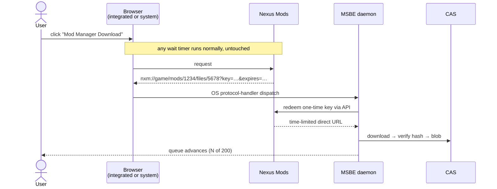

# 06 — Providers & Policy

Providers are technically uniform and legally _not_. The policy layer is a
first-class part of the design, not a README disclaimer — getting this wrong is the
most likely way this project dies, and it would die by C&D rather than by bug.

## 6.1 Uniform interface

```rust
trait Provider {
    fn search(&self, q: &Query)                 -> Result<Vec<Mod>>;
    fn versions(&self, id: &ModId)              -> Result<Vec<ModVersion>>;
    fn artifacts(&self, v: &ModVersionId)       -> Result<Vec<Artifact>>;
    fn acquire(&self, a: &ArtifactId)           -> Result<Acquisition>;
    fn policy(&self)                            -> &ProviderPolicy;
}

enum Acquisition {
    DirectUrl { url, headers, expires },
    BrowserAssisted { page_url, capture: CaptureSpec },   // user must act
    Unavailable { reason, user_action },                  // e.g. "download on site"
}
```

`Acquisition` is deliberately a three-way enum. "We cannot fetch this for you" is a
normal, well-typed outcome — not an error and not an invitation to work around it.

## 6.2 Policy matrix

| Provider               | Auth                               | Programmatic download      | Notable constraints                                                                                                                                                                                                                                                                                                                                                                                                                                                                                                                                                          |
| ---------------------- | ---------------------------------- | -------------------------- | ---------------------------------------------------------------------------------------------------------------------------------------------------------------------------------------------------------------------------------------------------------------------------------------------------------------------------------------------------------------------------------------------------------------------------------------------------------------------------------------------------------------------------------------------------------------------------- |
| **Modrinth**           | none for public; token for private | ✓ open API                 | **Implemented (M1).** Real dependency graph. Requires an identifying User-Agent; 300 requests a minute, surfaced as `RateLimited` with the reset time. Downloads are https-only and verified against the published size and SHA-512 before ingest. Updates are found with the bulk hash endpoints (`POST /version_files` and `/version_files/update`), at most four requests however many mods are installed. A mod stays on its release channel or moves to a more stable one, and never goes to an older version unless the installed one no longer supports the instance. |
| **Thunderstore**       | none                               | ✓                          | Clean SemVer, clean package format.                                                                                                                                                                                                                                                                                                                                                                                                                                                                                                                                          |
| **CurseForge**         | API key required                   | ✓ _conditionally_          | **Must honour `allowModDistribution: false`.** When false, third-party download is forbidden — return `Unavailable` and send the user to the mod page. Non-negotiable; this flag is why several managers got access revoked.                                                                                                                                                                                                                                                                                                                                                 |
| **Nexus Mods**         | personal API key / OAuth           | premium: ✓ direct. free: ✗ | Free accounts have no programmatic file download. The _supported_ path is the `nxm://` handler (see below). Rate limits published per-key; honour them and the `X-RL-*` response headers.                                                                                                                                                                                                                                                                                                                                                                                    |
| **GitHub Releases**    | optional token                     | ✓                          | Watch unauthenticated rate limits.                                                                                                                                                                                                                                                                                                                                                                                                                                                                                                                                           |
| **CKAN repos**         | none                               | ✓                          | Consume the existing index; do not fork it.                                                                                                                                                                                                                                                                                                                                                                                                                                                                                                                                  |
| **Steam Workshop**     | Steam account                      | SteamCMD or import         | **Planned.** MSBE may invoke a user-installed SteamCMD to acquire content the user's account is entitled to receive, or ingest a local file, archive, or directory obtained elsewhere. It will not implement Steam-client, depot, manifest, or authentication protocols itself.                                                                                                                                                                                                                                                                                              |
| **Local / direct URL** | n/a                                | ✓                          | Always available; the manual escape hatch. **Implemented (M1).** URLs must be https, redirects included. A `#sha256=` or `#sha512=` fragment pins a checksum that is verified before ingest, and every download's SHA-512 is recorded as provenance.                                                                                                                                                                                                                                                                                                                         |

TLS for every provider goes through `msbe-http`, which trusts the operating system's
certificate store rather than a bundled list of roots. That respects system and corporate
certificate authorities, and keeps `webpki-roots` (CDLA-Permissive-2.0, which `deny.toml`
does not allow) out of the dependency graph.

Encoded as data in `ProviderPolicy`, not as scattered `if` statements:

```rust
struct ProviderPolicy {
    requires_auth: bool,
    rate_limit: RateLimit,            // token bucket, honours Retry-After / 429
    respects_distribution_flag: bool,
    user_agent: &'static str,         // honest: "MSBE/0.4 (+https://…)"
    tos_url: &'static str,
    ack_required: bool,               // user must acknowledge once, per provider
}
```

## 6.3 Provider manifests

Provider definitions are versioned TOML documents. The M1 runtime loads the built-in direct
URL and Modrinth definitions through the same validated catalog that will consume signed
registry definitions. A manifest declares identity, source recognition, metadata origin,
policy, and an acquisition primitive; it cannot execute code, alter HTTP transport rules, or
weaken policy enforcement.

```toml
schema = 1
id = "modrinth"
name = "Modrinth"

[source]
type = "prefixed"
prefix = "modrinth:"

[metadata]
api_base = "https://api.modrinth.com/v2"

[acquisition]
type = "direct_https"

[policy]
requires_auth = false
respects_distribution_flag = true
tos_url = "https://modrinth.com/legal/terms"
ack_required = false
```

The schema rejects unknown fields, duplicate provider ids, empty or non-ASCII source prefixes,
and metadata endpoints that are not HTTPS. The acquisition vocabulary is closed. In M1 it
contains only `direct_https`: a reviewed adapter must still supply an HTTPS artifact URL and
the applicable hash/size validation. Future primitives such as `browser_assisted`,
`local_import`, and `steamcmd` require a runtime implementation and policy review before a
manifest can select them.

The schema above is the M1 subset. The target model is a **provider program**: a versioned TOML
document interpreted by a reviewed, fail-closed runtime. The program is the default way to add a
provider. It declares only a composition of closed vocabulary items; it never supplies code,
scripts, regular expressions, arbitrary HTTP templates, or response transformations.

```toml
[runtime]
type = "catalog-v1"

[routes]
search = "/search"
project = "/project/{reference}"
releases = "/project/{project}/version"

[records.project]
id = "/id"
title = "/title"

[records.release]
id = "/id"
number = "/version_number"
files = "/files"
dependencies = "/dependencies"

[compatibility]
game_versions = { query = "game_versions", encoding = "json-array" }
loaders = { query = "loaders", values = "target-loader-and-provides", encoding = "json-array" }
client_side = "/client_side"
server_side = "/server_side"

[downloads]
type = "release-files-v1"
url = "url"
name = "filename"
size = "size"
sha512 = { object = "hashes", key = "sha512" }
```

The generic runtime owns HTTPS-only URL resolution, endpoint-relative route expansion, fixed
request methods, response limits, pagination bounds, JSON-pointer extraction, scalar and enum
conversion, compatibility filtering, dependency-relation interpretation, rate limits, retries,
cache policy, and verified acquisition. Unknown vocabulary or fields fail closed. A program can
only select a runtime implementation shipped and reviewed by MSBE, such as `catalog-v1` or a
future `github-releases-v1`; it cannot alter that implementation's transport or policy rules.

Provider programs are signed registry artifacts. Local policy chooses trusted signing keys and
whether a program may be enabled. The daemon reports the program id, schema, signer, and selected
runtime to clients. An untrusted or unsupported program is visible for diagnosis but cannot make
network requests.

The M1 runtime resolves every recognized source through a fail-closed reviewed-adapter registry.
Only the built-in `modrinth` and `url` adapters are available today. M1 has no credential or
persisted-acknowledgement workflow, so providers declaring `requires_auth = true` or
`ack_required = true` are refused with an explicit unsupported-workflow error. This permits
future runtimes to declare stronger requirements without accidentally weakening policy on older
clients.

### Declarative provider programs

Provider programs use a deliberately small language. Each item has schema-defined semantics and
bounded resource use:

- **Source recognition:** `prefixed`, `https_url`, and future reviewed URI schemes.
- **Protocol runtimes:** named, versioned families such as `catalog-v1`; manifests configure
  declared slots but cannot describe arbitrary requests.
- **Routes and queries:** endpoint-relative literal segments plus URL-encoded named values, and
  a fixed set of query encodings.
- **Record mappings:** JSON pointers to typed scalar fields and bounded arrays; no expression
  language, implicit coercion, or user-provided parser.
- **Capabilities:** `search`, `releases`, `updates`, and acquisition modes selected from the
  runtime's advertised vocabulary.
- **Compatibility and relations:** named target fields, closed availability values, and closed
  dependency relation names.
- **Policy:** authentication posture, acknowledgement, distribution handling, rate-limit class,
  and terms metadata. The runtime enforces the restrictive interpretation.

This is intentionally not a universal REST client. A provider whose API, update semantics,
authentication flow, or legal policy cannot be represented safely uses `runtime = "native"` and
a reviewed native adapter. The manifest must name that exception and its reason. Native adapters
may use the same neutral records, acquisition service, policy gate, and conformance tests; they
do not create a second client-facing protocol.

### Adapter implementation contract

A provider program is the normal extension unit. A native adapter is a reviewed exception, not
the default extension unit. The workspace keeps generic interpreter behavior and exceptional
provider behavior separate:

| Crate                | Holds                                                                                                                                |
| -------------------- | ------------------------------------------------------------------------------------------------------------------------------------ |
| `msbe-provider-api`  | provider-program schema, runtime contracts, neutral records, `HttpClient`, verified acquisition, manifests, overlays, and resolution |
| `msbe-providers`     | reviewed runtime implementations, trusted program loading, codec registrations, and the shared fail-closed policy gate               |
| `msbe-provider-<id>` | only a native provider exception: wire records, protocol behavior, reviewed mappings, and a justification for code                   |

Adding a declarative provider is a signed provider program. Adding a native provider is a new
`msbe-provider-<id>` crate, one reviewed registration, and an explicit reason it cannot use an
existing runtime. The CLI, daemon, and `msbe-core` never name a provider. Every runtime or native
adapter must obey these boundaries:

1. **Registration-only entry.** The crate exports one `Registration`: its provider id,
   manifest, overlay entries and constructor. `Providers` checks the manifest's policy before
   the adapter parses a reference or makes a request, and refuses a manifest no registration
   serves. A source prefix alone never enables code or network access.
2. **Neutral records at the boundary.** Requests, projects, releases, files, dependencies,
   search results and update checks cross the trait as `msbe_provider_api::model` types. Wire
   records stay private to the adapter's crate.
3. **One compatibility input.** Search, releases and updates accept the shared `Target`
   `{ game_version, loader, provides, loader_version, side }`. Missing side metadata is
   incompatible; loader capabilities are explicit rather than inferred.
4. **Bounded metadata.** API calls use `JsonEndpoint` with endpoint-relative paths and a fixed
   response limit. Adapters do not construct URLs from untrusted identifiers or issue ad-hoc
   HTTP requests.
5. **Verified acquisition.** The default `Adapter::acquire` runs the shared acquisition service,
   which owns create-new streaming transfer, HTTPS-only URLs, safe output names, published size
   checks, and SHA-256/SHA-512 verification. The adapter supplies every integrity value it has
   in its release files.
6. **Capabilities, not stubs.** `as_search`, `as_releases` and `as_updates` return `None` unless
   the provider supports them, so a missing capability is known before a command starts.
   Provider-specific protocols, such as Modrinth's bulk hash lookups and release-channel policy,
   stay behind the capability they implement.
7. **Shared resolution.** An adapter that implements `Releases` gets dependency resolution, the
   overlay, installed-release pinning and PubGrub's explanations from `resolve::Resolver`; it
   never walks a dependency graph itself. A requirement on one provider's project can be met by
   another provider's project when the overlay says it stands in.

Modrinth is the reference adapter and implements all three capabilities. The `url` adapter
implements none: it returns a `Request::File` that needs no resolution, the shape an `nxm://`
link will take too.

### Pack codec capability

Pack formats are optional provider-extension capabilities, separate from acquisition adapters.
A codec detects and translates an external pack format into neutral requirements, or translates
a resolved lockfile and classified blobs into that format. It does not acquire files, resolve
dependencies, write game directories, or bypass the provider registry. The orchestration layer
routes every imported requirement back through the normal adapter and policy gate.

Format-specific archive paths, project/file IDs, game and loader wire names, environment flags,
and redistribution semantics stay in the extension crate. A provider may implement an adapter
without a codec, a codec without network acquisition, or both. The CLI, daemon, core and Desktop
discover codec descriptors and option schemas and do not name formats themselves.

The native `.msbepack` codec is provider-neutral and embeds a canonical lockfile plus a selected
set of CAS blobs. Blob sourceability and permission to redistribute are evaluated independently:
an unsourceable file is never assumed redistributable, and a provider prohibition cannot be
overridden by an export option. The complete registration contract, option schema, native layout,
error model and migration plan are specified in
[17](17-pack-formats-and-native-bundles.md).

## 6.4 What we will not do

Stated here so it is never re-litigated in a PR:

- No captcha solving, no wait-timer skipping, no ad-gate bypass.
- No spoofing premium status, session tokens, or another client's User-Agent.
- No scraping around a published rate limit, and no distributing shared API keys.
- No mirroring or re-hosting mod binaries.
- No ignoring `allowModDistribution: false` or any equivalent opt-out.
- No Steam credential handling, client-protocol emulation, depot or manifest access, or
  integration that bypasses Steam's normal entitlement and delivery controls.

MSBE identifies itself honestly in every request. If a provider asks us to change
something, we change it. The alternative is losing access for all users — which is
what has happened to every tool that treated these as obstacles.

## 6.5 Steam Workshop: SteamCMD or user-supplied content

Steam Workshop support is planned as an opt-in integration with the user's installed SteamCMD,
plus a local import boundary. Workshop delivery has game-specific layouts, subscription
semantics, and platform rules; MSBE will not infer permission to automate around any of them.
The supported workflows are deliberately narrow:

1. the user explicitly enables the SteamCMD adapter and points MSBE to their installed binary;
2. SteamCMD performs any authentication and entitlement checks through its own supported flow;
3. MSBE requests only the selected content, imports the resulting local artifact, and validates,
   hashes, stores, and deploys it through the normal plan;
4. alternatively, the user selects an exported file, archive, or directory obtained through the
   Steam client or another tool they choose;
5. MSBE records the source, content digest, and optional Workshop item URL or ID for display
   and update reminders.

The planned adapter must use a SteamCMD binary supplied by the user; it must not bundle or
modify SteamCMD, retain Steam credentials, emulate Steam protocols, inspect depot or manifest
data, or bypass entitlement, subscription, rate-limit, or content-owner controls. A game plan
may describe how an acquired artifact installs, but it does not grant MSBE permission to acquire
it. If SteamCMD cannot obtain an item through its supported flow, MSBE returns `Unavailable` and
offers the local-import path without suggesting a workaround.

Possible future conveniences are limited to local, user-initiated operations: importing a path,
checking whether its recorded content digest changed, and opening the item's public page in the
user's browser. Background downloads, subscription synchronization, and update polling remain
out of scope unless Valve publishes and permits a suitable integration path.

## 6.6 The `nxm://` path (why free Nexus users are fine)

Nexus provides "Mod Manager Download" buttons that emit `nxm://` links **for free
accounts too**. That is the sanctioned mechanism, and it is what MO2 and Vortex use.



MSBE registers the protocol handler on all three platforms and catches links from
**the integrated browser or the user's system browser alike** — a user who prefers
Firefox loses nothing.

## 6.7 Assisted download queue (the large-modpack case)

The honest version of "browser automation." For a 200-mod Nexus list on a free
account, MSBE:

1. resolves the list to concrete mod/file pages;
2. shows a queue with progress — _N of 200_;
3. navigates the integrated browser to the next page in the queue;
4. **waits for the user to click the download button**, and any wait timer runs
   normally, un-touched;
5. captures the resulting `nxm://` link, ingests the file, advances the queue.

The automation is _navigation and capture_, not _clicking through gates_. It removes
tab management and copy-pasting, which is the actual tedium, and it leaves every
access control exactly where the site put it. Rate-limited, resumable, and cancellable.

Optionally an "auto-advance" toggle moves to the next page after a successful capture.
There is no toggle that clicks the download button.

## 6.8 Operational asks

Tasks, not afterthoughts — start them early because approval takes weeks:

- Apply for an official **CurseForge API key** for a named application.
- Apply for a **Nexus Mods** application/API registration and open a channel with
  their team before launch, not after.
- Publish the User-Agent, contact address and a clear statement of what MSBE does and
  does not do, so providers can evaluate us without reverse-engineering traffic.
