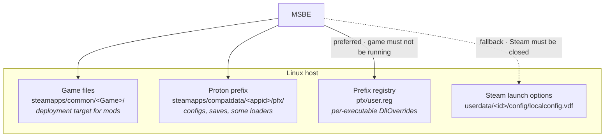

# 08 — Platforms, Detection & Runtimes

The unglamorous part that determines whether the tool works on a real machine. Most
mod-manager bug reports are path and runtime problems, not modding problems.

## 8.1 Store detection

| Store | Method | Gotchas |
|---|---|---|
| **Steam** | `libraryfolders.vdf` → per-library `appmanifest_<id>.acf` | Multiple libraries on multiple drives; **Flatpak Steam** relocates everything under `~/.var/app/com.valvesoftware.Steam/`; Steam Deck adds SD-card libraries that come and go |
| **GOG** | Galaxy DB (`galaxy-2.0.db`, SQLite) on Win/Mac; on Linux, no Galaxy — detect by `goggame-<id>.info` | Offline installers leave no registry trace at all |
| **Epic** | `.item` manifests in `…/Epic/EpicGamesLauncher/Data/Manifests` | No Linux client; usually via Heroic/Legendary instead |
| **Xbox / MS Store** | `Get-AppxPackage`, `WindowsApps` | **Hostile to modding**: locked ACLs, files not user-writable, package integrity checks. Detect, then *warn honestly* that modding may be impossible rather than failing mysteriously |
| **itch.io** | butler receipts / app DB | Loose conventions |
| **Heroic / Lutris / Bottles** | their own JSON/YAML configs | The realistic Linux path for Epic and GOG titles |
| **Manual** | user picks a folder, plan's `probe` rules confirm | Always available; the final fallback |

Detection is **plan-declared data** (`[game].detect` rules), not core code. Core
implements the *rule kinds* (`store`, `probe`, `registry`, `env`); plans supply values.
Every detection result is confirmed by at least one `probe = "file"` rule so a stale
manifest pointing at a deleted install is caught immediately.

Version detection matters as much as path detection — Minecraft's solver needs the
game version, and Bethesda plans behave differently across patches. Sources: PE/Mach-O
version resources, a known manifest file, or a hash of the main executable matched
against a registry table.

## 8.2 Proton / Wine — a first-class case, not a port

On Linux, many of these games are Windows binaries under Proton. This is the single
biggest area where existing cross-platform managers are weak, and it is where MSBE can
be plainly better.

What the plan model must express, and does:

- **Two roots, not one.** Mods go into the game directory; configs, saves and some
  loaders live inside the prefix under `drive_c/users/steamuser/…`. A plan addresses
  both via path variables (`@game.root`, `@runtime.prefix`, `@runtime.user_dir`), and
  the same plan therefore works natively on Windows where they coincide.
- **DLL overrides go into the prefix registry, not Steam.** BepInEx, ASI loaders and the
  `version`/`winhttp`/`dinput8` proxy family need Wine to load a native DLL from the game
  directory (`winhttp=n,b`). There are two places to say so, and they are not equal:

  | Route | Where | Constraint | Scope |
  |---|---|---|---|
  | **Prefix registry** (preferred) | `pfx/user.reg`, under `Software\Wine\AppDefaults\<game>.exe\DllOverrides` | the game's Wine processes must not be running | one executable |
  | **Steam launch options** (fallback) | `WINEDLLOVERRIDES=… %command%` in `localconfig.vdf` | **Steam must be closed** | the whole launch |

  The launch-options route is as bad as feared ([15](15-m0-findings.md)). Steam reads
  `localconfig.vdf` only at startup and overwrites edits made while it runs, and Valve has
  offered no API in the seven years since
  [steam-for-linux #6443](https://github.com/ValveSoftware/steam-for-linux/issues/6443)
  was opened. Steam is normally running, so this route mostly means asking the user to
  quit Steam.

  The registry route is BepInEx's primary documented Proton method, and it shrinks the
  constraint to "this game is not running," which MSBE checks by looking for that prefix's
  `wineserver`. Wine holds the registry in memory while it runs and writes it back on exit,
  so an edit made during play is lost; MSBE refuses rather than racing it. Writing under
  `AppDefaults\<game>.exe` rather than the prefix-wide `DllOverrides` key keeps the override
  away from launchers and helper executables that share the prefix. The writer must
  round-trip the format exactly (`WINE REGISTRY Version 2`, timestamped section headers) and
  is its own step, `set-dll-override`, distinct from `set-env`.

  Two cases still need the fallback:
  - **No prefix yet.** A prefix's registry is created on the game's first launch under
    Proton; in M0, 10 of 22 `compatdata` folders in one library had none. MSBE asks the user
    to launch the game once rather than fabricating a prefix.
  - **Launch arguments.** Loaders that need arguments or non-DLL environment variables have
    no registry equivalent and still go through `localconfig.vdf`.

  `msbe doctor` reports which route each instance uses and flags a pending launch-option
  change while Steam is running, since that is the silent-failure mode.
- **Proton version pinning.** A loader working under Proton 9 may break under
  Experimental. Instances record the Proton version and warn on change.
- **Path translation.** `Z:\` ↔ `/`, case sensitivity, and the fact that Wine is
  case-insensitive-ish while ext4 is not — a mod shipping `Data/Textures` against a
  game with `data/textures` works on Windows and breaks on Linux. The extract step
  detects case collisions and reports them as a real conflict class.
- **Steam Deck.** Immutable rootfs, SD-card libraries, Game Mode has no desktop
  session for a keyring. Supported via the headless secret fallback ([07](07-browser-and-secrets.md)).
- **Flatpak sandbox.** A Flatpak MSBE cannot see a non-Flatpak Steam library without
  a filesystem permission. Detect and instruct rather than showing an empty list.

## 8.3 Filesystem realities

- **Case sensitivity** — Linux ext4/btrfs sensitive, Windows NTFS insensitive, macOS
  APFS configurable. Mods routinely have inconsistent casing. Plans declare
  `case_policy = "preserve" | "fold-to-game"`, and the extractor detects collisions.
- **Path length** — Windows `MAX_PATH` 260 without long-path opt-in. Deep Minecraft
  config trees hit this. Long paths enabled in the manifest, plus a preflight check.
- **Reserved names** — `CON`, `PRN`, `AUX`, `NUL`, `COM1`… and trailing dots/spaces
  are legal on Linux, illegal on Windows. A cross-platform lockfile must be checked
  against the *target* platform's rules, not the authoring one.
- **Unicode normalization** — macOS HFS+ legacy NFD versus NFC elsewhere; the same
  filename hashes differently. Normalize to NFC in the CAS, record the on-disk form.
- **Filesystem type lies.** An NTFS drive mounted through ntfs-3g reports `fuseblk` in
  `findmnt` and `fuse` from `stat -f`; nothing names NTFS. Capabilities are never inferred
  from the type string ([04 §4.2](04-deployment-engine.md)).
- **Libraries on several volumes are normal.** Steam users routinely add libraries on extra
  drives, often NTFS drives shared with Windows. Each volume gets its own store shard
  ([04 §4.1](04-deployment-engine.md)).
- **Network shares and case-insensitive volumes** break hardlinks and reflinks
  silently — hence the real probe in [04 §4.2](04-deployment-engine.md).

## 8.4 Launching the game

MSBE does not replace the launcher. It offers `msbe launch` that goes *through* the
store where one exists (`steam://rungameid/<id>`), so overlay, playtime, cloud saves
and achievements keep working. Direct-executable launch is a fallback, and the UI says
which one it used — users blame the mod manager when Steam stops counting hours.
