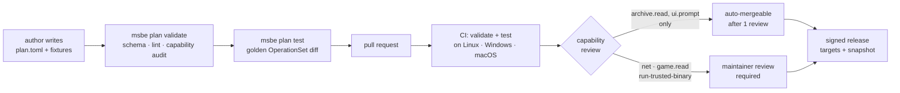

# 10 — The Registry

MSBE hosts **plans and curated metadata**. It never hosts mod binaries.

## 10.1 What lives there

```
registry/
  plans/<plan-id>/
    plan.toml
    extensions/*.wasm          + .sha256
    automation/*.js            origin-scoped browser scripts
    fixtures/                  synthetic archives + golden OperationSets
  overlay/<game-id>/
    <provider>/<mod-id>.toml   deps, conflicts, provides, replaces, known-bad,
                               load-order hints, install quirks
  components/<id>.toml         loaders & script extenders: upstream URL + hashes
  providers/<provider-id>.toml provider identity, policy, and constrained adapter config
  index.json                   generated; what clients actually fetch
```

The **overlay** is the real value. Upstreams publish "this mod exists"; they almost
never publish "these two mods corrupt saves together" or "version 3.2.1 breaks on
Proton." Communities know it and currently write it in forum posts and pinned comments.
An overlay entry turns that into something a solver can act on:

```toml
mod = "nexus:skyrimse/12345"

[[conflicts]]
with = "nexus:skyrimse/67890"
severity = "hard"
reason = "Both patch the same actor records; produces broken NPCs."
source = "https://…"          # evidence is mandatory

[[known-bad]]
version = "3.2.1"
reason  = "Crashes on load under Proton ≥ 9.0."
fixed-in = "3.2.2"
```

Evidence links are required for `conflicts` and `known-bad`. This is what keeps the
overlay from becoming a rumour mill, and it gives reviewers something to check.

`provides` and `replaces` name packages a mod can stand in for, with the solver semantics in
[05 §5.5](05-solver.md):

```toml
schema   = 1
mod      = "modrinth:qvIfYCYJ"   # Quilted Fabric API
provides = ["modrinth:P7dR8mSH"] # Fabric API
replaces = []                    # successors of abandoned mods go here
```

A mod may not provide or replace itself, or both provide and replace the same package.
Until the registry ships, MSBE compiles in the entries it carries
(`crates/msbe-providers/src/overlays/`), in this format and with this validation.

## 10.2 Distribution & trust

Git-backed, content-addressed, signed. **TUF-lite** role separation — a compromised
build machine must not be able to silently ship a new plan:

| Role        | Holds                                   | Rotation                  |
| ----------- | --------------------------------------- | ------------------------- |
| `root`      | offline key, signs role delegations     | rare, manual, multi-party |
| `targets`   | signs plan/extension hashes             | per release               |
| `snapshot`  | signs the index, prevents mix-and-match | per publish               |
| `timestamp` | short-lived, prevents freeze attacks    | frequent, automated       |

Clients pin `root`, verify the chain, and **refuse to downgrade** a plan version.
Lockfiles pin the exact plan version and extension hash used, so a build reproduces
even if the registry later changes — and if the registry changes in a way that would
alter a locked result, `msbe sync` says so rather than silently drifting.

Users can add additional registry sources (`msbe registry sources add`), each with its
own trust root, clearly marked as third-party in the UI. Plans from an untrusted source
get _no_ WASM capabilities beyond `archive.read` without explicit per-capability
consent.

Provider manifests are signed registry targets too. They are declarative configuration for a
closed set of built-in acquisition primitives, never executable provider code. A manifest may
configure an adapter's accepted source prefix, HTTPS metadata origin, and policy declaration;
adding an acquisition primitive or a provider adapter remains a reviewed code change. This lets
communities contribute transparent provider definitions without letting a registry update add a
new downloader or weaken provider safeguards. See [06](06-providers-and-policy.md#63-provider-manifests).

## 10.3 Contribution flow



The gate that makes community contribution safe: **capability tiers**. A plan that
only extracts and places files is low-risk and reviewable by anyone. A plan requesting
network access, game-file reads, or `run-trusted-binary` gets human scrutiny
proportional to what it asked for. The manifest declares this up front, so the review
burden is visible in the diff rather than hidden in code.

No plan merges without fixtures. That rule means a reviewer who has never played the
game can still verify the plan does what it claims.

## 10.4 Consuming foreign indexes

CKAN is a working, curated index maintained by people who know KSP. Forking it would
be both rude and worse. The `ckan` provider consumes it directly, mapping netkan
metadata onto MSBE's model, and the KSP plan is thin. The registry abstraction is
designed so that other ecosystems' indexes (packwiz manifests, Thunderstore's API,
a future community index) plug in the same way.

## 10.5 Operational

- Static hosting — the index and signatures are files; a CDN or GitHub Pages suffices.
  Cost near zero, which matters for a project with no revenue.
- A bot opens PRs for component upstream updates (new BepInEx, new Fabric) with hashes.
- `msbe registry update` is delta-fetched and offline-tolerant; a stale registry
  degrades to "no new metadata," never to a broken client.
- A moderation policy and a contact address exist _before_ launch, because the overlay
  is user-generated content and will eventually be abused.
