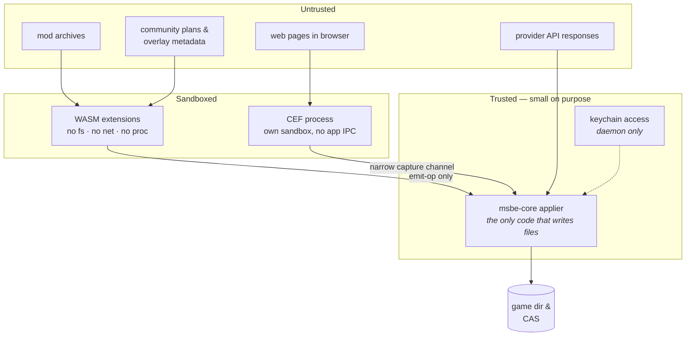

# 11 — Threat Model & Security

MSBE downloads untrusted archives from the internet and writes them into directories
the user cares about, guided by documents contributed by strangers, while holding API
tokens. Each of those is a distinct trust boundary.

## 11.1 Boundaries

The trusted set is deliberately tiny: one applier module and one secrets module. Review
effort concentrates there.

## 11.2 Malicious archives

Every one of these has been used against real extraction code:

| Attack | Defence |
|---|---|
| **Zip-slip** (`../../etc/…`) | canonicalize every entry against the target root *after* joining; reject anything escaping. Never trust the entry name. |
| **Absolute paths** (`/etc/x`, `C:\…`) | rejected outright |
| **Windows traversal** (`..\`, `C:x`, UNC `\\?\`) | rejected on all platforms, not just Windows — a lockfile is cross-platform |
| **Symlink/hardlink escape** | symlink entries not extracted by default; when a plan opts in, targets must resolve inside the root |
| **Decompression bomb** | caps on total uncompressed size, entry count, and compression ratio; streamed, never `read_to_end` |
| **Case collision** (`Data/` + `data/`) | detected; reported as a conflict class, not silently merged |
| **Reserved names / trailing dots** | validated against the *target* platform's rules |
| **NTFS alternate data streams**, `:` in names | stripped/rejected |
| **Unicode homoglyph & RTL-override names** | normalized to NFC; bidi control characters rejected |
| **Nested archive recursion** | bounded depth |
| **Device/FIFO entries in tar** | never created |

`msbe-archive` is the only crate allowed to touch archive input, has no `unsafe`
(`#![forbid(unsafe_code)]`), and is **continuously fuzzed** (`cargo-fuzz`) against all
supported formats. The RAR path is treated with extra suspicion given its history.

## 11.3 Malicious plans

The operations-only WASM design ([02 §2.5](02-plan-system.md), [18](18-wasm-extensions.md))
means an extension cannot perform an unmodelled action. Remaining risk is a plan whose
extension returns *legitimate-looking but harmful* operations — e.g. `place` into a path
outside the instance.

Defences:
- every returned operation is **checked by the host** against the extension's declared
  operation kinds and roots and against the mod's own files, and its path must be safe and
  relative; extension output is treated as untrusted input;
- fuel metering, a memory ceiling, a read budget, and no ambient time, randomness or network;
- capability grants are declared per extension in the plan, and a module that imports an
  ungranted capability fails to load;
- `run-trusted-binary` is a separate, hash-pinned, always-prompting step — never
  reachable from WASM;
- capability tiers gate registry review effort ([10 §10.3](10-registry.md)).

## 11.4 Supply chain

- Registry: TUF-lite, downgrade-proof, lockfile-pinned ([10 §10.2](10-registry.md)).
- App: signed releases, reproducible builds as a goal, SBOM published per release.
- Dependencies: `cargo-deny` (licences, advisories, duplicate/yanked crates) and
  `cargo-audit` in CI; the .NET side runs `dotnet list package --vulnerable`.
- CEF component: pinned version, signature-verified on download, tracked for CVEs.
- Components (BepInEx, Fabric): hashes pinned in the registry, so a compromised
  upstream release does not silently propagate.

## 11.5 Local security

- **Never elevated.** MSBE refuses to run as root/Administrator. If a path is not
  user-writable (MS Store games), that is a diagnosis, not a prompt to elevate.
- Daemon socket is user-only (`0600` / per-user pipe DACL); TCP mode is opt-in,
  token-authenticated, loopback-default, TLS-required off-loopback.
- Secrets handled per [07 §7.5](07-browser-and-secrets.md): daemon-only, zeroized,
  redaction filter in front of the logger and property-tested.
- Support bundles are redacted by the same filter and print a summary of what was
  removed before the user shares the file.
- Extension signing keys stay with their publisher: `msbe extension keygen` creates a key
  readable only by its owner and never replaces one, and `sign` refuses a key other users
  can read. Which signers an installation trusts is local policy in `extensions/trust.toml`,
  which trusts no one by default ([18 §18.3](18-wasm-extensions.md)).

## 11.6 Safety-of-the-user concerns

Not strictly security, but the same duty of care:

- **Anticheat.** Plans declare it. Modding a game with kernel anticheat gets a blocking
  warning naming the ban risk, and MSBE offers no special support for defeating it.
- **Multiplayer integrity.** Plans declare a `multiplayer_risk` level so the UI can be
  honest about whether a mod is likely to be considered cheating.
- **Save-game risk.** Removing a mod mid-playthrough can corrupt saves. MSBE offers
  save backup before a profile switch and warns on removal of save-affecting mods
  (an overlay-metadata flag).
- **Destructive operations** (`purge`, `store gc`, instance removal) always show a
  concrete preview and require explicit confirmation; `--yes` does not cover them.
