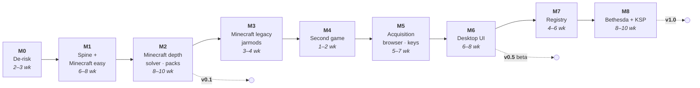

# 13 — Roadmap

Sequenced so the riskiest unknowns are answered first and every milestone ends with
something usable rather than something demoable.

## The sequencing insight: install difficulty ≠ acquisition difficulty

The obvious first game is the one with the simplest install. That reasoning is a trap.

No Man's Sky's *install* is trivial — extract a zip, copy `.pak` files into
`GAMEDATA/MODS`, done. But its *acquisition* runs through Nexus, which means an early
NMS milestone drags the entire hard infrastructure — integrated browser, keychain,
`nxm://` handling, assisted download queue — onto the critical path in order to support
a game whose install logic is one `place` step. Maximum infrastructure cost for minimum
domain learning.

Minecraft inverts this:

- **Acquisition is free.** Modrinth's API needs no key, no account and no browser.
  A real provider ships in M1 without a single credential.
- **The difficulty gradient is inside one game.** Dropping a `.jar` into `mods/` is the
  easiest install in modding. Injecting classes into `minecraft.jar` and deleting
  `META-INF/` is in-place container mutation. Both are Minecraft, and everything in
  between is too.
- **It reaches every axis.** See [02 §2.1](02-plan-system.md) — Minecraft alone exercises
  all eight, which means the abstraction gets stressed before a second game exists.

So **Minecraft is the sole v0.1 game**, and No Man's Sky moves later to become something
more useful than a first game: the *portability test* (M4) and then the *acquisition*
test (M5), as two separate milestones, because they are two separate problems.

## M0 — De-risk (2–3 weeks)

Throwaway spikes with written conclusions, answering what could invalidate the
architecture before anything is built on it.

- **Avalonia 12 + NativeAOT + `CommunityToolkit.Mvvm`** — publish a non-trivial window
  with a virtualized 1000-row list and compiled bindings on all three OSes. Measure
  binary size and startup. *The single biggest assumption in the stack.*
- **wasmtime host** — a component-model extension that reads a fixture archive and emits
  operations, with fuel metering and a capability denial that actually denies.
- **Filesystem probes** — `FICLONE` / `clonefile` / `CreateHardLink` against real ext4,
  btrfs, NTFS, APFS and a network share. Confirm the probe tells the truth.
- **Proton reality check** — install a loader into a Proton prefix by hand, note every
  step, confirm the `localconfig.vdf` / Steam-running problem is as bad as expected.
- **CEF hosting** — *not on the v0.1 path any more*, but spike it anyway: it validates
  the process-separation architecture, and knowing now is worth two days.

**Exit criterion**: a written go/no-go on the C# UI, with the fallback (non-AOT desktop
plus AOT CLI, or a Rust-native UI) decided rather than deferred.

## M1 — Core spine + Minecraft, easy path (6–8 weeks)

The vertical slice, using the easiest install in modding so that the *engine* is what
gets exercised, not the domain.

`msbe-core` (plan schema, step engine, resolve/apply), `msbe-archive` (hardened, fuzzed),
`msbe-fsops` (CAS, backends, journal, rollback), `msbe-cli`, `msbe-daemon`, SQLite state,
synthetic-game fixtures, crash-injection suite. Minecraft plan covering modern
Fabric/NeoForge: `.jar` → `mods/`, with hygiene filtering and the exclusion report.
Providers: local file, direct URL, then **Modrinth** — no auth, no browser, real data.

**Done when**: mods install into a real Minecraft instance from local files and Modrinth,
profiles switch, `verify`, `rollback`, and `purge` returns the instance byte-identical to
vanilla — on Linux, Windows and macOS, entirely from the CLI.

## M2 — Minecraft in depth → **v0.1** (8–10 weeks)

Where the domain gets hard, still without touching credentials.

- **Target pre-filter** — `{ game_version, loader, loader_version, side }` applied before
  version solving, with loader-level `provides` so a Quilt target accepts Fabric mods.
  This is the Forge/NeoForge/Fabric/Quilt split, which is the defining structural fact of
  Minecraft modding and the reason the game is worth building against first.
- **PubGrub solver** with Fabric/NeoForge version-range semantics, reading dependency
  metadata from `fabric.mod.json` and `neoforge.mods.toml`.
- **Virtual packages** — Fabric API forks and reimplementations, `replaces` for abandoned
  mods.
- **Loader bootstrap as a component** — Fabric and NeoForge installation and version
  pinning, including the launcher profile JSON.
- **Structured config merge** across TOML, JSON/JSON5 and `.properties`, with the user
  override layer that survives updates.
- **Multiple deploy targets in one plan** — `mods/`, `config/`, `resourcepacks/`,
  `shaderpacks/`, per-world `datapacks/`.
- **Pack import** — `.mrpack` and CurseForge `manifest.json` (metadata-only; CurseForge
  *downloads* wait for M5, and the distribution flag is honoured from day one).
- **Lockfiles** and cross-platform reproducibility.

**Done when**: a 250-mod modpack imports, resolves, deploys, updates and rolls back; the
same lockfile reproduces on another OS; `msbe bisect` finds a deliberately broken mod.
**This is v0.1 — usable, CLI-only, no credentials required.**

## M3 — Minecraft's legacy topologies (3–4 weeks)

The reason Minecraft alone can validate the abstraction: its own history contains install
models that are structurally unlike the modern one.

- **Jarmods** — pre-1.6 mods whose class files are injected *into* `minecraft.jar`, in
  order, with `META-INF/` removed to defeat the signature check. This is Axis D's
  *in-place container injection* plus an ordered mutation, and nothing in M1–M2 touches it.
- **Coremods and ASM transformers** (1.6–1.12 Forge), `coremods/`, `.cfg` configs, and
  the much weaker `mcmod.info` dependency metadata — the solver must degrade honestly.
- **Server ecosystems** — Bukkit/Paper `plugins/` are a *different loader for the same
  game*, with a disjoint mod ecosystem. One plan declares both as loader variants
  ([02](02-plan-system.md)) and a Profile's Target picks one; M3 is where that model
  gets its first real test against two genuinely incompatible ecosystems.

**Done when**: a 1.7.10 Forge pack and a 1.5.2 jarmod setup both install and purge
cleanly, and the plan schema needed no new step kinds to express them. If it did need
new steps, that is the finding and it is cheap to act on now.

## M4 — Second game: No Man's Sky, local archives only (1–2 weeks)

**This milestone is a measurement, not a feature.** Everything learned across M1–M3
claims to be game-agnostic; NMS is where that claim gets tested by someone writing a plan
for an unrelated game with no core changes.

Scope deliberately excludes acquisition: mods come from local zips and direct URLs. Pure
install topology — extract, hygiene filter, place `.pak` files, lexical ordering, optional
pak-check component.

**Done when**: the NMS plan is written and tested *without modifying `msbe-core`*. If it
takes more than two weeks, or if core had to change, the eight axes are wrong and the
schedule should stop until that is resolved — which is exactly why this milestone sits
here rather than at the end.

## M5 — The acquisition stack (5–7 weeks)

Now the browser, credentials and automation earn their place, because two games already
need them and a third (Bethesda) is coming.

Keychain with the headless fallback a server admin actually needs. Thunderstore and
GitHub Releases. Nexus with `nxm://` handler registration on all three platforms.
CurseForge downloads with strict `allowModDistribution` honouring. `msbe-browser` as an
optional CEF component with the assisted download queue.

**Provider API applications are submitted at the start of this milestone** — approval
takes weeks, and this is the first point where they block anything.

**Done when**: a free Nexus account queues and ingests a 50-mod NMS list without
copy-pasting, and CurseForge's distribution flag is honoured correctly.

## M6 — Desktop UI → **v0.5 public beta** (6–8 weeks)

Avalonia against the existing RPC. Mod list, install preview including the exclusion
report, conflict tree, wizard host, download queue, browser tab, journal with one-click
rollback. Accessibility and i18n included, not deferred.

## M7 — Registry (4–6 weeks)

Public registry, TUF-lite signing with role separation, `plan validate` / `plan test` in
CI, capability-tier review, overlay metadata schema, contribution docs, moderation policy,
component update bot. This is when the project stops being one person's tool.

## M8 — Bethesda + KSP → **v1.0** (8–10 weeks)

The hard families last, by which point the abstraction has been stressed by Minecraft's
three eras plus an unrelated game. FOMOD wizard as a WASM extension, plugin load order
with master-graph topological sort and LOOT masterlist consumption, ESL/ESP limits, VFS
backends (USVFS on Windows, fuse-overlayfs on Linux), BSA handling. CKAN provider for KSP
validates the foreign-index path.

**v1.0** when four unrelated games work well on three platforms and a third party has
contributed a plan without maintainer hand-holding.

## Explicitly after v1

Save-game management, mod authoring helpers, a GUI plan editor, cloud profile sync,
Steam Deck Game Mode UI, and any form of social or sharing service.
