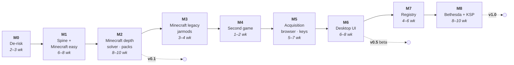

# 13 — Roadmap

Sequenced so the riskiest unknowns are answered first and every milestone ends with
something usable rather than something demoable.

## The sequencing insight: install difficulty ≠ acquisition difficulty

The obvious first game is the one with the simplest install. That reasoning is a trap.

No Man's Sky's _install_ is trivial — extract a zip, copy `.pak` files into
`GAMEDATA/MODS`, done. But its _acquisition_ runs through Nexus, which means an early
NMS milestone drags the entire hard infrastructure — integrated browser, keychain,
`nxm://` handling, assisted download queue — onto the critical path in order to support
a game whose install logic is one `place` step. Maximum infrastructure cost for minimum
domain learning.

Minecraft inverts this:

- **Acquisition is free.** Modrinth's API needs no key, no account and no browser.
  A real provider ships in M1 without a single credential.
- **The difficulty gradient is inside one game.** Dropping a `.jar` into `mods/` is the
  easiest install in modding. Injecting classes into `minecraft.jar` and deleting
  `META-INF/` is in-place container mutation. Both are Minecraft, and everything in
  between is too.
- **It reaches every axis.** See [02 §2.1](02-plan-system.md) — Minecraft alone exercises
  all eight, which means the abstraction gets stressed before a second game exists.

So **Minecraft is the sole v0.1 game**, and No Man's Sky moves later to become something
more useful than a first game: the _portability test_ (M4) and then the _acquisition_
test (M5), as two separate milestones, because they are two separate problems.

## M0 — De-risk (2–3 weeks) · mostly answered, see [15](15-m0-findings.md)

Throwaway spikes with written conclusions, answering what could invalidate the
architecture before anything is built on it. A time-boxed first pass, using primary docs
plus live evidence from a real machine, settled most of it and changed three designs.

| Spike                                             | Status                               | Outcome                                                              |
| ------------------------------------------------- | ------------------------------------ | -------------------------------------------------------------------- |
| Avalonia 12 + NativeAOT + `CommunityToolkit.Mvvm` | publish **proven**; launch pending   | 0 trim/AOT warnings; 33.4 MB shippable on linux-x64                  |
| wasmtime host                                     | **supported by docs**; not executed  | denial is structural: unlinked imports fail instantiation            |
| Filesystem probes                                 | **proven** on ext4 and NTFS          | → store is **per volume**; hardlink is the Linux default             |
| Proton reality check                              | **confirmed**, and largely avoidable | → DLL overrides go in the **prefix registry**, not `localconfig.vdf` |
| CEF hosting                                       | **better than planned**              | → `msbe-browser` is **Rust on `cef-rs`**                             |

**Decision: GO on the C# UI**, conditional on the AOT binary launching. Fallback decided: a
self-contained non-AOT publish of the same app. A Rust-native UI is no longer carried as a
fallback.

**Remaining M0 work** (see [15 — Still open](15-m0-findings.md#still-open)): launch and time
the AOT binary; the virtualized 1000-row list; Windows and macOS AOT publishes; a wasmtime
component with a denied import; live APFS, ReFS, btrfs, XFS and network-share probes; one
loader installed by hand through the Proton registry route; a `cef-rs` build that captures
`nxm://`.

**Exit criterion**: a written go/no-go on the C# UI, with the fallback decided rather than
deferred. _Written. The go is conditional on the first remaining item._

## M1 — Core spine + Minecraft, easy path (6–8 weeks)

The vertical slice, using the easiest install in modding so that the _engine_ is what
gets exercised, not the domain.

`msbe-core` (plan schema, step engine, resolve/apply), `msbe-archive` (hardened, fuzzed),
`msbe-fsops` (CAS, backends, journal, rollback), `msbe-cli`, `msbe-daemon`, SQLite state,
synthetic-game fixtures, crash-injection suite. Minecraft plan covering modern
Fabric/NeoForge: `.jar` → `mods/`, with hygiene filtering and the exclusion report.
Providers: local file, direct URL, then **Modrinth** — no auth, no browser, real data.

**Done when**: mods install into a real Minecraft instance from local files and Modrinth,
profiles switch, `verify`, `rollback`, and `purge` returns the instance byte-identical to
vanilla — on Linux, Windows and macOS, entirely from the CLI.

**Status (2026-09-11): local files, direct URLs and Modrinth work end to end.** Tested on Linux, including
live against api.modrinth.com; the crates that do not link `ring` are lint-clean for Windows:

| Piece                                                                                                                                                                                                                                                                                                                                                                                            | State                                                                                                                                                            |
| ------------------------------------------------------------------------------------------------------------------------------------------------------------------------------------------------------------------------------------------------------------------------------------------------------------------------------------------------------------------------------------------------ | ---------------------------------------------------------------------------------------------------------------------------------------------------------------- |
| `msbe-fsops`: store shard, capability probe, journaled applier, rollback, crash recovery, verify-before-link with store repair, read-only-safe replacement, empty-directory removal                                                                                                                                                                                                              | done, with crash injection at every checkpoint; the Windows path is tested with simulated Windows semantics but has not run on Windows                           |
| `msbe-plan-schema` and the resolver: loaders, extract and place steps, exclusion report, `[deploy] mutable` paths                                                                                                                                                                                                                                                                                | done                                                                                                                                                             |
| `msbe-archive`: bare-file and `.zip` ingest, refusing unsafe paths, symlinks, bombs, oversized files and case collisions                                                                                                                                                                                                                                                                         | done; a deterministic mutation suite (every truncation and byte flip, plus random mutations, plus lying size headers) runs on stable, cargo-fuzz targets not yet |
| `msbe-core::instance`: profiles, diff-based deploy (which is how profiles switch), conflict detection, verify, rollback, purge, provenance, mutable files that keep runtime changes, removal of directories MSBE created once nothing needs them, and a two-phase commit with the journal                                                                                                        | done                                                                                                                                                             |
| `msbe-provider-api`, `msbe-providers`, and `msbe-provider-modrinth`: reviewed adapter contract and policy registry; direct https URLs with pinned checksums through the `direct-url-v1` provider program; Modrinth search, target-filtered candidate collection, PubGrub exact-release solving, verified HTTPS downloads, and update checks through the bulk hash endpoints that keep each mod on its release channel, all served by the `catalog-v1` Modrinth provider program | done; artifact-derived Fabric/NeoForge ranges remain M2 work                                                                                                     |
| `msbe-http`: HTTPS over rustls and `ring`, roots from the OS trust store, https only (redirects included), an identifying User-Agent, rate-limit reporting                                                                                                                                                                                                                                       | done                                                                                                                                                             |
| `msbe-cli`: `instance add\|set\|list`, `profile`, `add` (files, archives, `https://` URLs, `modrinth:<project>[@version]`, `--with-deps`), `search`, `update [<mod>...] [--dry-run]`, `remove`, `deploy [--dry-run]`, `rollback`, `purge`, `verify`, `status`, `--format json`, exit codes 0/1/2/4/7                                                                                             | done; end-to-end tests purge to byte-identical vanilla                                                                                                           |
| `plans/minecraft/plan.toml` for Fabric, Quilt and NeoForge                                                                                                                                                                                                                                                                                                                                       | done                                                                                                                                                             |

Still open in M1:

- **A Windows run.** Replacing a read-only hardlink, which Windows refuses for a plain rename,
  is now handled (`docs/04` §4.2), and removal already works through the standard library.
  The tests simulate Windows semantics, but the suite has not yet run on Windows itself.
- **Fuzz targets** for `msbe-archive` (a stable-toolchain mutation suite covers the gap for
  now), **macOS** runs, and a **Windows named-pipe daemon transport**. The Unix daemon is
  available now: it serializes `command.run` requests over a mode-0600 local socket, and the
  CLI launches and uses it by default.
- **State storage.** Profiles and deployment history are TOML and JSON files. SQLite is
  deferred until the daemon needs an index.

The Modrinth candidate graph is now resolved with PubGrub, including exact release constraints
and backtracking. Reading Fabric/NeoForge version ranges from artifacts remains M2 work.

## M2 — Minecraft in depth → **v0.1** (8–10 weeks)

Where the domain gets hard, still without touching credentials.

- **Target pre-filter** — **implemented**: `{ game_version, loader, loader_version, side }`
  is applied before version selection, with loader-level `provides` so a Quilt target accepts
  Fabric mods. This is the Forge/NeoForge/Fabric/Quilt split, which is the defining structural
  fact of Minecraft modding and the reason the game is worth building against first.
- **PubGrub solver** — **implemented for Modrinth's target-filtered candidate graph**, including
  exact release requirements and backtracking. Fabric/NeoForge version-range semantics and
  dependency metadata from `fabric.mod.json` and `neoforge.mods.toml` remain pending.
- **Virtual packages** — **implemented**: overlay `provides` and `replaces` on solver
  candidates, with one supplier per package, replacements preferred over abandoned originals
  and originals over forks. Built-in overlay entries cover Quilted Fabric API and Forgified
  Fabric API, and installed mods take part in resolution. Registry-distributed overlays wait
  for M7.
- **Loader bootstrap as a component** — Fabric and NeoForge installation and version
  pinning, including the launcher profile JSON.
- **Structured config merge** — deterministic recursive TOML, JSON/JSON5 and `.properties`
  merging plus a validated `merge-config` plan step are implemented. Transactional generated-file
  deployment and the separately persisted user override layer remain pending.
- **Multiple deploy targets in one plan** — `mods/`, `config/`, `resourcepacks/`,
  `shaderpacks/`, per-world `datapacks/`.
- **Pack import and export** — the initial Modrinth path works, but its wire model and
  Minecraft/loader mapping currently leak into generic pack and CLI crates. It is migration debt,
  not the extension pattern. The target architecture registers format codecs with provider
  extensions, routes neutral requirements through the normal provider policy gate, and adds a
  provider-neutral `.msbepack` codec over lockfiles and selected CAS blobs. CurseForge support
  requires its reviewed adapter and codec; metadata-only parsing does not authorize acquisition
  or redistribution. Before any external format moves onto the codec contract, Phase A2 revises it
  for host-owned containers, profile lineage, environment inputs, derivation identity, and a
  facts/observations split in lockfiles. See [17](17-pack-formats-and-native-bundles.md).
- **Lockfiles and cross-platform reproducibility** — **implemented**: `msbe lock` writes a
  canonical TOML snapshot of the pinned plan, compatibility target, components, provider
  provenance, CAS digests, and portable relative deployment shape. Filesystem backend and host
  paths are intentionally excluded.

**Done when**: a 250-mod modpack imports, resolves, deploys, updates and rolls back; the
same lockfile reproduces on another OS; `msbe bisect` finds a deliberately broken mod. The
implemented bisection session persists deterministic module halves and deploys each trial through
the normal journal; dependency-closure and pair-interaction analysis remain future solver work.
**This is v0.1 — usable, CLI-only, no credentials required.**

## M3 — Minecraft's legacy topologies (3–4 weeks)

The reason Minecraft alone can validate the abstraction: its own history contains install
models that are structurally unlike the modern one.

- **Jarmods** — **implemented**: pre-1.6 mods whose class files are injected _into_ the game
  jar, in profile order, with `META-INF/` removed to defeat the signature check. The Minecraft
  plan's `jarmod` loader builds `versions/<version>-msbe` from the untouched vanilla jar and
  version manifest, so the official launcher runs it instead of re-downloading vanilla. This is
  Axis D's _in-place container injection_ plus an ordered mutation. **Finding:** it needed two new
  step kinds, `inject` and `edit-json`, a `loaders` list on steps, and an explicit profile `order`
  that Bethesda load order will reuse ([02](02-plan-system.md)). A run against a real 1.5.2 setup
  is still to come. **Open:** the injected jar derives from the user's vanilla jar, which the
  lockfile cannot yet classify or pin. Environment inputs and derivation identity
  ([17](17-pack-formats-and-native-bundles.md) §17.5) must land before jarmod profiles export.
- **Coremods and ASM transformers** (1.6–1.12 Forge), `coremods/`, `.cfg` configs, and
  the much weaker `mcmod.info` dependency metadata — the solver must degrade honestly.
- **Server ecosystems** — Bukkit/Paper `plugins/` are a _different loader for the same
  game_, with a disjoint mod ecosystem. One plan declares both as loader variants
  ([02](02-plan-system.md)) and a Profile's Target picks one; M3 is where that model
  gets its first real test against two genuinely incompatible ecosystems.

**Done when**: a 1.7.10 Forge pack and a 1.5.2 jarmod setup both install and purge
cleanly, and the plan schema needed no new step kinds to express them. If it did need
new steps, that is the finding and it is cheap to act on now.

## M4 — Second game: No Man's Sky, local archives only (1–2 weeks) — **implemented**

**This milestone is a measurement, not a feature.** Everything learned across M1–M3
claims to be game-agnostic; NMS is where that claim gets tested by someone writing a plan
for an unrelated game with no core changes.

Scope deliberately excludes acquisition: mods come from local zips and direct URLs. Pure
install topology — extract, hygiene filter, preserve each mod source tree beneath
`GAMEDATA/MODS`, optional pak-check component.

**Result (2026-09-11):** the first-party plan deployed a real local collection of No Man's
Sky archives on Linux without changes to `msbe-core`. In addition to generated `.pak` files,
the collection contained AMUMSS Lua, EXML, MBIN, and asset source trees, which the plan
preserves under `GAMEDATA/MODS`. Documentation and AMUMSS status text are quarantined in the
content store and reported in deployment previews. Full game-launch validation and pak-check
support remain open.

**Done when**: the NMS plan is written and tested _without modifying `msbe-core`_. If it
takes more than two weeks, or if core had to change, the eight axes are wrong and the
schedule should stop until that is resolved — which is exactly why this milestone sits
here rather than at the end.

## M5 — The acquisition stack (5–7 weeks)

Now the browser, credentials and automation earn their place, because two games already
need them and a third (Bethesda) is coming. Steam Workshop remains an import-only boundary:
MSBE may use a user-installed SteamCMD to acquire content the user's account is entitled to
receive, or process content the user acquired elsewhere; it ships no Steam credentials or
Steam-protocol integration.

Keychain with the headless fallback a server admin actually needs. Thunderstore and
GitHub Releases. Nexus with `nxm://` handler registration on all three platforms.
CurseForge downloads with strict `allowModDistribution` honouring. `msbe-browser` as an
optional CEF component with the assisted download queue.

**Provider API applications are submitted at the start of this milestone** — approval
takes weeks, and this is the first point where they block anything.

**Done when**: a free Nexus account queues and ingests a 50-mod NMS list without
copy-pasting, and CurseForge's distribution flag is honoured correctly.

## M6 — Desktop UI → **v0.5 public beta** (6–8 weeks)

Avalonia against the existing RPC. Mod list, install preview including the exclusion
report, conflict tree, wizard host, download queue, browser tab, journal with one-click
rollback. **Modpack creation**: poll supported mod APIs and repositories for updates and
metadata, search and compose a mod list, choose compatible versions and dependencies,
add and edit pack-owned configs, then validate and export a reproducible lockfile, a configurable
native MSBE bundle, or a distributable external pack through a provider-owned codec. Codec
options are schema-driven so Desktop does not hardcode a game or format. Accessibility and i18n
included, not deferred.

**Current checkpoint (approximately 30%)**: the desktop connects to the local daemon;
registers and browses instances; creates, clones, selects, and removes profiles; and
shows profile-ordered mods. Profile-specific loader, loader version, and side targets are
visible and editable, and changing them invalidates stale provider results. Users can add local files, URLs, and provider references,
remove selected mods, search compatible providers, include required dependencies, and
install a result into the selected profile. Pack-owned text configs can be added, edited,
removed, and validated into a canonical lockfile. The Pack page discovers export codecs from the
daemon and renders their option schemas and presets, previews export inclusion with policy
blockers and observation ages, previews imports and pack-layer updates with conflict resolution,
captures in-game changes with diffs, and runs each daemon-held plan as a job with progress and
cancellation. Deployment has a native review of ordered
filesystem operations, unchanged and locally kept counts, the exclusion report, explicit
confirmation before apply, and rollback of the latest transaction. Conflict resolution,
the full journal timeline, wizards, download progress, browser-assisted acquisition,
updates, snapshot restore from Desktop, complete accessibility, and i18n remain in this milestone.

**Done when**: a user can compose a pack from provider search, review the resolved list, edit
configuration files, select a discovered codec and its schema-driven options, and import the
export into a fresh profile with the same deployment digest map. Adding another format changes
one extension crate and one registration line, while generic clients and core contain no
provider, game, loader, or external-format branches.

## M7 — Registry (4–6 weeks)

Public registry, TUF-lite signing with role separation, `plan validate` / `plan test` in
CI, capability-tier review, overlay metadata schema, contribution docs, moderation policy,
component update bot. This is when the project stops being one person's tool.

## M8 — Bethesda + KSP → **v1.0** (8–10 weeks)

The hard families last, by which point the abstraction has been stressed by Minecraft's
three eras plus an unrelated game. FOMOD wizard as a WASM extension, plugin load order
with master-graph topological sort and LOOT masterlist consumption, ESL/ESP limits, VFS
backends (USVFS on Windows, fuse-overlayfs on Linux), BSA handling. CKAN provider for KSP
validates the foreign-index path.

**v1.0** when four unrelated games work well on three platforms and a third party has
contributed a plan without maintainer hand-holding.

## Explicitly after v1

Save-game management, mod authoring helpers, a GUI plan editor, cloud profile sync,
Steam Deck Game Mode UI, and any form of social or sharing service.
